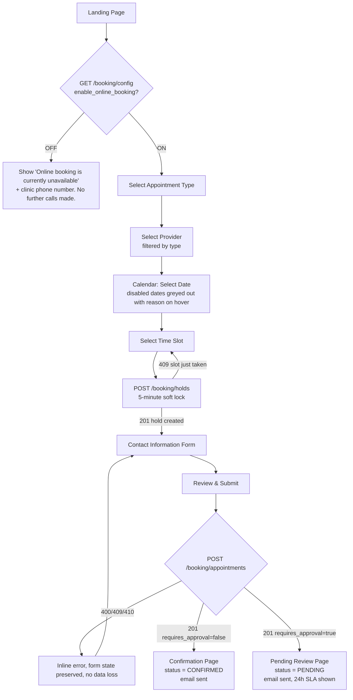
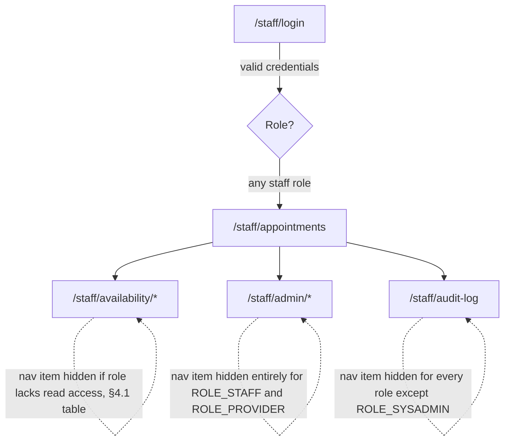
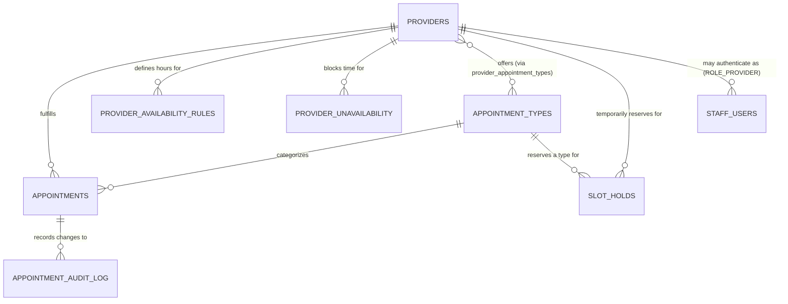
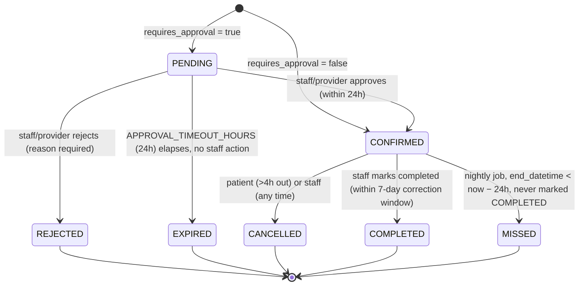

# Online Appointment Booking — Product Requirements Document

**Status:** Approved for implementation (Technical Review Board, Round 3 — resolved) · **Version:** 2.2.0 · **Owner:** Principal Solutions Architect · **Stack:** Java (Spring Boot) · Angular · MySQL 8

> **Note on this revision.** The prior version of this file (v1.x) was a *meta-prompt* — a set of instructions telling an AI to go write a PRD later ("Include: cancellation policy", "Describe: doctor availability"). A document made of instructions-to-produce-requirements cannot itself be a source of truth for autonomous coding agents, because every downstream agent would resolve those instructions differently. This version replaces every such instruction with an actual, numbered, testable decision. Section 0 lists the specific contradictions and gaps that made v1.x unsafe to build from, and how each is resolved in the sections that follow.
>
> **Note on v2.1.0.** A pre-implementation Architecture Readiness Review found the v2.0.0 document not yet implementation-ready: two schema gaps and a missing REST contract for the entire staff/admin configuration surface meant an autonomous agent would have had to invent behavior in violation of §17 rule 2. This revision resolves every finding — see §0.1. Every change is additive: no existing table, column, endpoint, status code, error code, validation rule, or acceptance criterion from v2.0.0 is altered or removed.
>
> **Note on v2.2.0.** A final Technical Review Board pass found four remaining specification contradictions introduced or exposed by v2.1.0 — see §0.2. Each is a narrow, internally-inconsistent statement (a missing schema field, a hierarchy rule that contradicted a stated permission, a list that was described as amended but never edited, and an undefined log value) — none required a design change, only making the document say one consistent thing instead of two conflicting things.

---

## 0. Architect's Review Notes — Ambiguities Resolved

| # | Issue in prior version | Resolution in this version |
|---|---|---|
| 1 | Document was instructions-for-a-PRD, not a PRD; contained zero concrete business rules an agent could implement without guessing. | Rewritten as a concrete spec: every rule below has explicit numbers, error codes, and schemas. |
| 2 | §12 lists 7 statuses (`Pending`, `Confirmed`, `Rejected`, `Expired`, `Missed`, `Cancelled`, `Completed`) but the linear flow in §3/§5 implies every booking is immediately confirmed — leaving `Pending`/`Rejected`/`Expired` with no defined trigger. | An `appointment_types.requires_approval` flag (§7, §12.7) determines whether a booking lands in `CONFIRMED` directly or `PENDING` pending staff action. Full lifecycle with triggers defined in §12.7. |
| 3 | The feature flag section didn't say whether it also gates *viewing/cancelling appointments already booked*, or whether it's global vs. per-provider. | §6 defines it as a single global flag that gates **creation-path** endpoints only (availability search, hold, create). Viewing/cancelling an existing appointment via confirmation token is never gated — a patient must always be able to manage a booking that already exists. |
| 4 | "Maximum appointments per patient per day" assumes a "patient" identity, but the flow has no login/authentication — identity was never defined. | §11.6 defines patient identity as the normalized composite key `lower(email) + phone`, since this is a guest-checkout flow with no account system (see §20, Non-Goals). |
| 5 | "Duplicate appointment prevention," "double booking prevention," and "slot locking" were listed as three separate, undifferentiated bullets in three different sections. | These are three distinct mechanisms and are now named and specified separately: **duplicate prevention** = same patient booking themselves twice (§11.7); **double booking** = two different patients racing for the same slot (§12.9, enforced at the DB layer); **slot locking** = the temporary hold that makes the checkout UX deterministic before the DB constraint is the final word (§12.10). |
| 6 | No timezone model. "Timezone handling" was listed as a bullet with no rule. | §11.10 fixes the model: clinic operates in one configurable IANA timezone, all persistence and wire transport is UTC ISO-8601, UI always renders and labels clinic-local time (never the visitor's browser timezone), explicitly to avoid a patient booking what they believe is their own local time. |
| 7 | §12 named "optimistic locking" and "slot locking" as bullets but MySQL cannot express a *partial* unique index (unique only among non-cancelled rows), which is exactly what "double booking prevention" requires — this is a real implementation trap, not a detail. | §7.8 specifies a generated `active_slot_key` STORED column that is `NULL` for terminal statuses and a composite key for active ones, with a UNIQUE index on it — MySQL treats multiple `NULL`s in a unique index as distinct, which correctly emulates a partial unique index. This is called out explicitly so no agent re-derives it incorrectly (e.g., by putting the unique constraint on `(provider_id, start_datetime)` unconditionally, which would make cancelled slots permanently unbookable). |
| 8 | Pagination/filtering/sorting were mandated in §8 but no parameters, defaults, or limits were ever specified. | §8.9 gives exact query parameters, defaults, and max page size for every list endpoint. |
| 9 | No idempotency mechanism was specified despite "duplicate submissions" being listed as a required edge case. | §8.4 mandates an `Idempotency-Key` request header on the booking-creation endpoint with a defined 24-hour dedup window and conflict semantics. |
| 10 | "No breaking changes" and "migration-first" were mandated with no API versioning scheme and no migration tool named. | §16 pins Flyway for migrations and `/api/v1` URI versioning, with an explicit additive-only change policy. |
| 11 | Weekend/holiday blocking was stated as an unconditional rule, which conflicts with realistic healthcare workflows where some providers work Saturdays. | §12.1 makes clinic hours a *default* that individual providers can override via `provider_availability_rules`; holidays remain a hard block for all providers (§12.4). |
| 12 | "Booking cooldown" and "booking timeout" were named in §12 with no numeric value, and rate limiting in §15 had no numeric value either. | §12.11 and §15.7 both give exact numbers (5-minute hold TTL, 24-hour approval timeout, per-IP rate limits). |
| 13 | No definition of what protects a confirmation/cancellation link from being guessed or enumerated. | §8.7/§15.3 specify a cryptographically random UUIDv4 confirmation token, never the sequential primary key, plus rate limiting on the lookup endpoint. |
| 14 | §19 asked for "at least 50 edge cases" as a bare list with no defined expected behavior — a list of edge case *names* is not implementable. | §19 is a table: every edge case has a defined expected system behavior, not just a label. |
| 15 | Personas included Receptionist/Doctor/Administrator with no auth model, despite the rest of the document assuming an anonymous patient flow. | §2 and §9.7/§10.9 scope a minimal staff-facing authenticated surface (session-based, role-gated) sufficient to make those personas' actions in §12.7 (approve/reject/complete) meaningful, without expanding this into a full staff scheduling product (§20, Non-Goals). |

### 0.1 Architecture Readiness Review — Round 2 Resolutions (v2.0.0 → v2.1.0)

A pre-implementation Architecture Readiness Review was conducted against this document across 17 evaluation categories (product, data, API, frontend, backend, feature flag, validation, security, performance, concurrency, scalability, error handling, accessibility, maintainability, trunk-based development, and AI-implementation readiness). The review concluded the document was **not yet implementation-ready**: two schema gaps and a cluster of missing REST contracts for the staff/admin surface meant an autonomous agent would have had to invent behavior in violation of §17 rule 2. Every finding is resolved in this revision, continuing the numbering from the table above:

| # | Issue found in Architecture Readiness Review | Resolution in this revision |
|---|---|---|
| 16 | No `staff_users` table existed anywhere in §7, despite §2/§9/§10 requiring authenticated, role-scoped staff/provider login. | §7.12 adds a complete `staff_users` table with a role enum, a nullable `provider_id` FK, and lockout-tracking columns. |
| 17 | §8.6's idempotency contract required comparing "the request body hash," but no column stored it. | §7.7 adds `request_body_hash CHAR(64)`; §8.6 documents the exact canonicalization and comparison algorithm. |
| 18 | §2 grants Administrator/SysAdmin CRUD and read capabilities (appointment types, providers, availability rules, unavailability, holidays, feature flag, audit log) with **no corresponding endpoints** in §8. | §8.12–§8.18 add full CRUD/read contracts for all seven capabilities. |
| 19 | §4's Screen Inventory had no route for any admin capability or for staff login itself. | §4 adds eight screens (staff login, three availability sub-screens, two admin screens, audit log) plus a §4.1 navigation-flow diagram. |
| 20 | §12.7 described rescheduling as "cancel + create" without specifying whether this was one atomic operation or two independent client calls — leaving a failure between the two calls undefined (the patient could lose their original slot with nothing to show for it). | §8.19/§12.13 specify a single atomic `POST .../reschedule` endpoint with an explicit transaction boundary: any failure rolls back the cancellation, so the original appointment is never lost. |
| 21 | No CORS policy was defined anywhere, despite the Angular SPA and Spring Boot API being separate origins in every environment, including local development. | §15.8 defines an explicit origin allowlist, credentialed-cookie handling for the staff console, and a centralized `CorsConfigurationSource` bean. |
| 22 | Staff password hashing, complexity rules, failed-login handling, lockout, and session timeout were all deferred as "standard... not re-specified," but a concrete `staff_users` table now exists and needs concrete rules. | §15.9 specifies BCrypt (cost factor 12), password length/composition rules, a 5-attempt/15-minute lockout, and session timeout values. |
| 23 | The three `@Scheduled` jobs (§14) are safe to run more than once but were never declared safe (or unsafe) to run **concurrently on multiple instances** — a real question once the app is horizontally scaled (§14). | §12.14 requires distributed locking (ShedLock, §7.13) so each scheduled run executes on exactly one instance, in addition to the pre-existing idempotent `WHERE`-clause design. |

This revision is **additive-only**, consistent with §7.10/§16: new subsections are appended at the end of their parent section (e.g., §7.12, §8.19) specifically so that every existing cross-reference in this document (e.g., "§7.7", "§8.9", "§12.9") remains valid and unchanged.

### 0.2 Technical Review Board — Round 3 Resolutions (v2.1.0 → v2.2.0)

A final Technical Review Board pass, focused solely on "would this force an implementation agent to guess," found four contradictions — three introduced by v2.1.0's own additions, one pre-existing gap that v2.1.0's reschedule feature made newly load-bearing. Continuing the numbering from the tables above:

| # | Issue found in Technical Review Board pass | Resolution in this revision |
|---|---|---|
| 24 | `slot_holds` (§7.8) never stored `appointment_type_id`, and `POST /booking/appointments` (§8.6) never accepted it either — yet `appointments.appointment_type_id` is `NOT NULL` and §11.9/§12.7/§19 #16 all require it to be known at submission time. No mechanism carried the value from hold to booking. | §7.8 adds an `appointment_type_id` column (FK to `appointment_types`) to `slot_holds`, populated at hold-creation time (§8.5) and read back at booking-creation time (§8.6) — the client never resends it. |
| 25 | §2's blanket role hierarchy (`ROLE_SYSADMIN ⊇ ROLE_ADMIN ⊇ ROLE_STAFF`) contradicted §2's own statement that System Administrator is "read-only... plus flag toggle," which §4.1's matrix also reflected — but §8.10 and §8.12–§8.16's `ROLE_ADMIN+`/`ROLE_STAFF+` notation implied ROLE_SYSADMIN inherited write access via the hierarchy. | §2 now states the hierarchy applies to **read access only**; mutating (write) authority is a separate, explicitly-enumerated grant per endpoint that never includes `ROLE_SYSADMIN` except the one named exception (feature-flag toggle, §8.17). Every write endpoint in §8.10/§8.12–§8.17 and every role reference in §4/§4.1 now names its permitted roles explicitly instead of using open-ended `+` notation for write access. |
| 26 | §8.19 asserted the reschedule endpoint was "added to the §6 gated-endpoint list," but §6's own list (and §10's "five gated controller methods") were never actually edited to include it. | §6's gated-endpoint list now has six entries, including the reschedule endpoint; §10's count is updated to match; §8.19 states the fact directly instead of describing an "amendment." |
| 27 | `appointment_audit_log.changed_by` (§7.9) was documented as only `'SYSTEM'` or a staff username, but §12.13 (reschedule) introduced the undefined term "the patient's identity descriptor" for patient-initiated transitions, and §8.8 (patient cancellation) never specified a value at all. | §7.9 now defines exactly three permitted forms: `'SYSTEM'`, `<staff_users.username>`, or `'PATIENT_SELF_SERVICE'`. §8.8, §12.7, and §12.13 are updated to use the literal value `'PATIENT_SELF_SERVICE'`, with the audit row's `reason` column carrying the distinguishing detail (e.g., `'RESCHEDULED'`) between a plain cancellation and the cancel-leg of a reschedule. |

No existing table, endpoint, status code, error code, validation rule, or acceptance criterion is removed by this revision; the four fixes above touch only the specific sentences and fields that were self-contradictory.

---

## 1. Product Vision

**Objective.** Let a patient book, view, and cancel an appointment with a specific provider at a specific clinic entirely online, without calling the front desk or creating an account, while giving clinic staff the controls needed to keep the schedule correct (approvals, holidays, provider absences).

**User problem.** Patients currently must call during business hours to book, competing with walk-ins and phone queues; staff spend time on scheduling that could be self-service for the common case (a routine appointment with an open slot).

**Business goals.**
- Reduce phone-based scheduling volume for standard appointment types.
- Eliminate double-bookings and scheduling conflicts caused by manual, phone-based coordination.
- Preserve clinic control over appointment types that need clinical triage before confirmation (new patients, specialists).

**Success criteria** (measurable, tied to §14 targets):
- ≥95% of booking attempts for non-approval appointment types complete without a staff touch.
- Zero double-booked slots in production (enforced structurally per §7.8, not just by application logic — this is a hard invariant, not an aspiration).
- P95 time-to-confirmation (landing page to confirmation screen) under 90 seconds for a returning flow (provider and type already decided).

**Non-goals** (see §20 for the full exclusion list): payment collection, insurance verification, multi-clinic/multi-tenant support, native mobile apps, EHR/telehealth integration, recurring appointment series, patient accounts/login history.

---

## 2. Personas

| Persona | Authenticated? | Goals | System capabilities |
|---|---|---|---|
| **Patient** | No (guest flow, identified by email + phone) | Book an appointment quickly; know exactly what happens if something goes wrong; cancel without calling. | Browse availability, hold a slot, submit booking, view/cancel via confirmation token (§8.7/§8.8). |
| **Receptionist** | Yes (`ROLE_STAFF`) | Keep the day's schedule accurate; handle bookings that need a human (approvals, phone-in reschedules staff perform on the patient's behalf). | List/search appointments, approve/reject `PENDING` bookings, mark `COMPLETED`/`MISSED`, record ad hoc provider unavailability. |
| **Doctor / Provider** | Yes (`ROLE_PROVIDER`) | See their own schedule; approve or reject bookings that require clinical triage; block time off. | Same as Receptionist but scoped to their own `provider_id` only (enforced server-side, §10.9). |
| **Clinic Administrator** | Yes (`ROLE_ADMIN`) | Configure what's bookable at all: appointment types, provider rosters, holiday calendar, the feature flag itself. | CRUD on `appointment_types`, `providers`, `provider_availability_rules`, `clinic_holidays`, and the `enable_online_booking` flag. |
| **System Administrator** | Yes (`ROLE_SYSADMIN`) | Operate the system: monitor health, roll the flag back in an incident, read audit logs. | Read-only on all staff data plus flag toggle and access to `appointment_audit_log` (§7.9). |

**Role hierarchy — read access only:** `ROLE_SYSADMIN` ⊇ `ROLE_ADMIN` ⊇ `ROLE_STAFF` for **GET/read** endpoints — a higher role can always view what a lower role can view, so `ROLE_SYSADMIN` reads everything. `ROLE_PROVIDER` is a parallel, scope-limited role (a provider is never granted staff-wide visibility) and is not part of this read chain.

**Write (mutating) authority does not follow that hierarchy.** It is a separate, explicitly-enumerated grant per endpoint: `ROLE_ADMIN` can perform every mutating action `ROLE_STAFF` can (clinic-operations chain), and `ROLE_PROVIDER` can perform the subset of those actions scoped to its own `provider_id` (§10.9). `ROLE_SYSADMIN` performs **no** mutating action by virtue of sitting atop the read hierarchy — per this table's own row above, it is read-only plus one named exception: toggling `enable_online_booking` (§8.17). Every mutating endpoint in this document (§8.10, §8.12–§8.17) names its permitted roles explicitly for exactly this reason — `ROLE_ADMIN`/`ROLE_STAFF` "+" notation is not used for write authority, only for read authority, to avoid the ambiguity of a "+" silently including `ROLE_SYSADMIN` in a write grant it was never meant to have.

Staff authentication mechanics (login form, session/JWT issuance) are standard and are intentionally not re-specified beyond §7.12/§15.9 — implement with Spring Security using session cookies + CSRF token (§15.4), since the staff console is a traditional authenticated web surface, unlike the anonymous patient flow.

---

## 3. User Journey



**Alternate flows** (each maps to a row in §19):
- **Flag flipped mid-session:** the flag is re-checked server-side on every mutating call (hold, create), not just on page load. If a patient reaches step G/J after the flag was turned off mid-session, the request is rejected with `FEATURE_DISABLED` and the UI routes back to the landing-page-off state rather than showing a dead form.
- **Browser refresh / back button:** the hold token and in-progress form data live in `sessionStorage`, not component state, so a refresh at steps F–I restores the in-progress booking as long as the hold has not expired (§12.10).
- **Session/hold timeout:** if the 5-minute hold expires before submission, `POST /booking/appointments` returns `410 SLOT_HOLD_EXPIRED`; the UI returns the user to slot selection with the message "That time slot was only held for 5 minutes and has been released — please pick a time again," and the previously entered contact info is retained.
- **Cancellation flow (separate entry point, not part of the linear flow above):** patient opens the link from their confirmation email (`/appointments/{confirmationToken}`), which calls `GET /booking/appointments/{token}` (never gated by the feature flag), and can cancel via `DELETE /booking/appointments/{token}` subject to the cutoff in §12.6.
- **Rescheduling flow (separate entry point, not part of the linear flow above):** from the same Appointment Lookup page, a `CONFIRMED` appointment outside the 4-hour cutoff shows a "Reschedule" action that re-enters slot selection (§4) scoped to the same provider/type, acquires a new hold (§8.5), and submits via the single atomic `POST /booking/appointments/{token}/reschedule` (§8.19/§12.13) — never as a separate cancel-then-book pair of calls.

---

## 4. Scope & Screen Inventory

| Screen | Route | Purpose |
|---|---|---|
| Landing / Booking Entry | `/book` | Flag check, entry point, "unavailable" state |
| Appointment Type Selection | `/book/type` | List active `appointment_types` |
| Provider Selection | `/book/provider` | List providers offering the selected type |
| Date & Slot Selection | `/book/schedule` | Calendar + slot grid for the selected provider/type |
| Contact Information | `/book/details` | Reactive form: name, email, phone, notes |
| Review & Confirmation | `/book/confirm` | Final review, submit, success/pending state |
| Appointment Lookup | `/appointments/:token` | View/cancel/reschedule an existing booking (token from email) |
| Staff Login | `/staff/login` | Username/password entry point for the staff console; issues a session cookie + CSRF token on success (`ROLE_STAFF`/`ROLE_PROVIDER`/`ROLE_ADMIN`/`ROLE_SYSADMIN`) |
| Staff Console — Appointments | `/staff/appointments` | List/filter/approve/reject/complete (role-gated) |
| Staff Console — Availability | `/staff/availability` | Parent route for the three sub-screens below; redirects to `/staff/availability/hours` by default. Read access `ROLE_STAFF`+; write access varies by sub-screen |
| Staff Console — Availability: Hours | `/staff/availability/hours` | Manage `provider_availability_rules` (write: `ROLE_ADMIN` only; read: `ROLE_STAFF`+, `ROLE_PROVIDER` scoped to own `provider_id`, §2) |
| Staff Console — Availability: Time Off | `/staff/availability/unavailability` | Record ad hoc `provider_unavailability` (write: `ROLE_STAFF` or `ROLE_ADMIN`, `ROLE_PROVIDER` scoped to own `provider_id`; `ROLE_SYSADMIN` excluded, §2) |
| Staff Console — Availability: Holidays | `/staff/availability/holidays` | Manage `clinic_holidays` (write: `ROLE_ADMIN` only, §2) |
| Admin — Appointment Types | `/staff/admin/appointment-types` | CRUD on `appointment_types` (write: `ROLE_ADMIN` only, §2) |
| Admin — Providers | `/staff/admin/providers` | CRUD on `providers`, including which appointment types each offers (write: `ROLE_ADMIN` only, §2) |
| Admin — System Settings | `/staff/admin/settings` | Toggle `enable_online_booking` (write: `ROLE_ADMIN` or `ROLE_SYSADMIN` — the one exception to SysAdmin's read-only scope, §2) |
| Audit Log | `/staff/audit-log` | Read-only `appointment_audit_log` viewer (`ROLE_SYSADMIN` only) |

Every screen's field-level behavior is specified in §9 (frontend), every validation in §11, every API call in §8, every error in §13.

### 4.1 Staff Console Navigation Flow



Role-visibility matrix (✅ = read+write, 👁 = read-only, — = hidden from nav and blocked server-side if called directly):

| Nav item | `ROLE_STAFF` | `ROLE_PROVIDER` | `ROLE_ADMIN` | `ROLE_SYSADMIN` |
|---|---|---|---|---|
| Appointments | ✅ all providers | ✅ own provider only | ✅ all providers | 👁 all providers |
| Availability → Hours | 👁 | 👁 own provider only | ✅ | 👁 |
| Availability → Time Off | ✅ | ✅ own provider only | ✅ | 👁 |
| Availability → Holidays | 👁 | 👁 | ✅ | 👁 |
| Admin → Appointment Types | — | — | ✅ | 👁 |
| Admin → Providers | — | — | ✅ | 👁 |
| Admin → System Settings (flag) | — | — | ✅ | ✅ |
| Audit Log | — | — | — | 👁 |

This matrix is enforced server-side on every endpoint in §8.12–§8.18 (§10's authorization pattern); the frontend nav guard (§9) only hides items to avoid a confusing dead-end click, never as the actual access control.

---

## 5. Appointment Booking Flow (Sequence)

```mermaid
sequenceDiagram
    participant U as Patient (Angular SPA)
    participant API as Booking API (Spring Boot)
    participant SVC as BookingService
    participant DB as MySQL

    U->>API: GET /api/v1/booking/config
    API-->>U: 200 { enabled: true }

    U->>API: GET /api/v1/booking/availability?providerId&appointmentTypeId&date
    API->>SVC: computeAvailableSlots(...)
    SVC->>DB: SELECT appointments, slot_holds, availability rules, holidays
    DB-->>SVC: rows
    SVC-->>API: available slot list
    API-->>U: 200 { slots: [...] }

    U->>API: POST /api/v1/booking/holds { providerId, appointmentTypeId, startDateTime }
    API->>DB: INSERT INTO slot_holds (unique on provider_id+start_datetime)
    alt slot already held or booked
        DB-->>API: duplicate key violation
        API-->>U: 409 SLOT_ALREADY_BOOKED
    else hold acquired
        DB-->>API: OK
        API-->>U: 201 { holdToken, expiresAt } (TTL 5 min)
    end

    U->>API: POST /api/v1/booking/appointments<br/>Header Idempotency-Key<br/>Body { holdToken, patient info }
    API->>SVC: createAppointment(...)
    SVC->>DB: validate hold not expired; INSERT INTO appointments (unique active_slot_key)
    alt hold expired
        DB-->>SVC: hold missing/expired
        SVC-->>API: error
        API-->>U: 410 SLOT_HOLD_EXPIRED
    else race lost to a concurrent booking
        DB-->>SVC: duplicate key on active_slot_key
        SVC-->>API: error
        API-->>U: 409 SLOT_ALREADY_BOOKED
    else success
        DB-->>SVC: appointment row (status CONFIRMED or PENDING)
        SVC->>DB: DELETE FROM slot_holds WHERE hold_token = ?
        SVC-->>API: AppointmentResponse
        API-->>U: 201 Created { confirmationToken, status }
    end
```

**Cancellation** and **duplicate-booking prevention** are not steps in this linear flow — they are cross-cutting rules specified once, in §12.6 and §11.7 respectively, and referenced from wherever they apply, to avoid the contradiction in the prior version where the same rule was implied in three different sections with three different implicit meanings.

---

## 6. Feature Flag — `enable_online_booking`

**Model.** Single global boolean, persisted in the `feature_flags` table (§7.9), cached in-application with a 10-second TTL (so a toggle takes effect within 10 seconds cluster-wide without a redeploy, and without hitting the DB on every request).

**Scope of gating — exactly these six endpoints are gated (return `403 FEATURE_DISABLED` when off):**
- `GET /api/v1/booking/appointment-types`
- `GET /api/v1/booking/providers`
- `GET /api/v1/booking/availability`
- `POST /api/v1/booking/holds`
- `POST /api/v1/booking/appointments`
- `POST /api/v1/booking/appointments/{confirmationToken}/reschedule` (§8.19/§12.13) — a reschedule structurally creates a new `active_slot_key` commitment exactly like a fresh booking, so it is gated for the same reason as the other five; it is not on the "never gated" list below, since — unlike plain view/cancel — it creates new state rather than only reading or terminating existing state.

**Explicitly NOT gated** (always available regardless of flag state, because they service bookings that already exist and were made when the flag was on):
- `GET /api/v1/booking/appointments/{confirmationToken}`
- `DELETE /api/v1/booking/appointments/{confirmationToken}`
- The entire staff console (`/api/v1/staff/**`), including the endpoint that flips the flag itself — an admin must be able to turn booking back on.

| Layer | Behavior when OFF |
|---|---|
| **Frontend** | `GET /booking/config` returns `{ "enabled": false }`; the `/book/**` route guard redirects any deep link to `/book` and renders the "unavailable" state with the clinic phone number. No booking components are rendered (not just hidden via CSS — not present in the DOM, to prevent an in-flight session from silently posting to a disabled endpoint without feedback). |
| **Backend** | Every gated controller method checks `FeatureFlagService.isEnabled("enable_online_booking")` as the *first* statement before any other validation, and short-circuits with `403 FEATURE_DISABLED`. This ordering matters: a disabled flag must not leak information about slot availability or validation state. |
| **Database** | No schema change; the row `feature_flags.enable_online_booking` is simply `is_enabled = FALSE`. Existing `appointments` rows are untouched — turning the flag off never cancels or modifies existing bookings. |
| **API** | Gated endpoints return `403` with body `{"errorCode": "FEATURE_DISABLED", "message": "Online booking is currently unavailable."}`. Non-gated endpoints behave identically regardless of flag state. |
| **Logging** | Every flag check that results in a block is logged at `INFO` with the endpoint and (if available) a correlation ID — not `WARN`/`ERROR`, since this is expected, intentional behavior, not a fault. |
| **UI** | See Frontend row above; additionally, if the flag flips to OFF while a patient is mid-flow (steps D–I in §3), the very next mutating call fails with `403` and the SPA's global HTTP error interceptor routes to the "unavailable" state rather than displaying a raw error toast. |

---

## 7. Database Design

**Design principles:** every timestamp is UTC (`DATETIME(3)`, millisecond precision, no `TIMESTAMP` — avoids the MySQL `TIMESTAMP` 2038 range limit and implicit timezone conversion); every table has `created_at`/`updated_at`; the two tables with real business lifecycles (`appointments`, `providers`) use soft delete (`deleted_at`) — nothing else needs it because nothing else is user-facing content with a retention requirement.

### 7.1 `providers`
```sql
CREATE TABLE providers (
  id             BIGINT UNSIGNED AUTO_INCREMENT PRIMARY KEY,
  first_name     VARCHAR(100) NOT NULL,
  last_name      VARCHAR(100) NOT NULL,
  specialty      VARCHAR(150) NOT NULL,
  email          VARCHAR(254) NOT NULL UNIQUE,
  timezone       VARCHAR(64)  NOT NULL DEFAULT 'America/New_York',
  is_active      BOOLEAN      NOT NULL DEFAULT TRUE,
  created_at     DATETIME(3)  NOT NULL DEFAULT CURRENT_TIMESTAMP(3),
  updated_at     DATETIME(3)  NOT NULL DEFAULT CURRENT_TIMESTAMP(3) ON UPDATE CURRENT_TIMESTAMP(3),
  deleted_at     DATETIME(3)  NULL,
  INDEX idx_providers_active (is_active, deleted_at)
) ENGINE=InnoDB;
```
`timezone` exists per-provider (not just clinic-wide) because a realistic multi-location clinic has providers in different IANA zones; `is_active` (not hard delete) lets a departed provider's historical appointments remain intact while removing them from booking (§11.9 covers referential edge cases).

### 7.2 `appointment_types`
```sql
CREATE TABLE appointment_types (
  id                 BIGINT UNSIGNED AUTO_INCREMENT PRIMARY KEY,
  code               VARCHAR(50)  NOT NULL UNIQUE,
  display_name       VARCHAR(150) NOT NULL,
  duration_minutes   SMALLINT UNSIGNED NOT NULL,
  buffer_minutes     SMALLINT UNSIGNED NOT NULL DEFAULT 0,
  requires_approval  BOOLEAN NOT NULL DEFAULT FALSE,
  is_active          BOOLEAN NOT NULL DEFAULT TRUE,
  created_at         DATETIME(3) NOT NULL DEFAULT CURRENT_TIMESTAMP(3),
  updated_at         DATETIME(3) NOT NULL DEFAULT CURRENT_TIMESTAMP(3) ON UPDATE CURRENT_TIMESTAMP(3)
) ENGINE=InnoDB;
```

Seed data (the concrete, non-negotiable defaults referenced throughout this document):

| code | display_name | duration_minutes | buffer_minutes | requires_approval |
|---|---|---|---|---|
| `NEW_PATIENT` | New Patient Intake | 45 | 15 | true |
| `GENERAL_CONSULT` | General Consultation | 30 | 0 | false |
| `FOLLOW_UP` | Follow-Up | 15 | 0 | false |
| `SPECIALIST_CONSULT` | Specialist Consultation | 60 | 15 | true |

`buffer_minutes` extends the *busy window* used by availability computation (so the next appointment can't start immediately after, giving staff turnaround time) without being billed as patient-facing duration — the slot grid shown to the patient reflects only `duration_minutes`.

### 7.3 `provider_appointment_types`
```sql
CREATE TABLE provider_appointment_types (
  provider_id          BIGINT UNSIGNED NOT NULL,
  appointment_type_id  BIGINT UNSIGNED NOT NULL,
  PRIMARY KEY (provider_id, appointment_type_id),
  FOREIGN KEY (provider_id) REFERENCES providers(id),
  FOREIGN KEY (appointment_type_id) REFERENCES appointment_types(id)
) ENGINE=InnoDB;
```
Join table — not every provider offers every type (e.g., only specialists offer `SPECIALIST_CONSULT`).

### 7.4 `provider_availability_rules`
```sql
CREATE TABLE provider_availability_rules (
  id           BIGINT UNSIGNED AUTO_INCREMENT PRIMARY KEY,
  provider_id  BIGINT UNSIGNED NOT NULL,
  day_of_week  TINYINT UNSIGNED NOT NULL,  -- 0=Sunday .. 6=Saturday
  start_time   TIME NOT NULL,
  end_time     TIME NOT NULL,
  rule_type    ENUM('WORKING','BREAK') NOT NULL DEFAULT 'WORKING',
  FOREIGN KEY (provider_id) REFERENCES providers(id),
  CONSTRAINT chk_rule_time_order CHECK (start_time < end_time)
) ENGINE=InnoDB;
```
Default seed per active provider: `WORKING` Mon–Fri 09:00–17:00, `BREAK` Mon–Fri 12:00–13:00 (§12.1). A provider who wants Saturday hours gets an additional `WORKING` row for `day_of_week = 6` — this is how §12.1's "weekends blocked by default, overridable per provider" is actually implemented, resolving issue #11 in §0.

### 7.5 `provider_unavailability`
```sql
CREATE TABLE provider_unavailability (
  id              BIGINT UNSIGNED AUTO_INCREMENT PRIMARY KEY,
  provider_id     BIGINT UNSIGNED NOT NULL,
  start_datetime  DATETIME(3) NOT NULL,
  end_datetime    DATETIME(3) NOT NULL,
  reason          VARCHAR(255) NOT NULL,
  created_by      VARCHAR(150) NOT NULL,
  created_at      DATETIME(3) NOT NULL DEFAULT CURRENT_TIMESTAMP(3),
  FOREIGN KEY (provider_id) REFERENCES providers(id),
  CONSTRAINT chk_unavail_time_order CHECK (start_datetime < end_datetime),
  INDEX idx_unavail_range (provider_id, start_datetime, end_datetime)
) ENGINE=InnoDB;
```
Covers vacation, sick leave, and emergency closures (§12.3/§12.8) for a single provider. When a staff member inserts a row here that overlaps an existing `PENDING`/`CONFIRMED` appointment, the system does **not** silently orphan the appointment: it flags every overlapping appointment for staff review (a `needs_attention` computed view, not a stored column) rather than auto-cancelling, because only a human should decide whether to reschedule or cancel a patient's existing booking.

### 7.6 `clinic_holidays`
```sql
CREATE TABLE clinic_holidays (
  id                     BIGINT UNSIGNED AUTO_INCREMENT PRIMARY KEY,
  holiday_date           DATE NOT NULL UNIQUE,
  name                   VARCHAR(150) NOT NULL,
  is_recurring_annually  BOOLEAN NOT NULL DEFAULT FALSE
) ENGINE=InnoDB;
```
Applies to **every** provider with no override — a clinic-wide closure is absolute, unlike per-provider hours.

### 7.7 `appointments` (core table)
```sql
CREATE TABLE appointments (
  id                   BIGINT UNSIGNED AUTO_INCREMENT PRIMARY KEY,
  confirmation_token   CHAR(36) NOT NULL UNIQUE,
  provider_id          BIGINT UNSIGNED NOT NULL,
  appointment_type_id  BIGINT UNSIGNED NOT NULL,
  patient_full_name    VARCHAR(100) NOT NULL,
  patient_email        VARCHAR(254) NOT NULL,
  patient_phone        VARCHAR(20)  NOT NULL,
  notes                VARCHAR(500) NULL,
  start_datetime       DATETIME(3) NOT NULL,  -- UTC; excludes buffer
  end_datetime         DATETIME(3) NOT NULL,  -- UTC; includes buffer
  status               ENUM('PENDING','CONFIRMED','CANCELLED','COMPLETED','REJECTED','EXPIRED','MISSED')
                       NOT NULL DEFAULT 'CONFIRMED',
  cancellation_reason  VARCHAR(255) NULL,
  idempotency_key      CHAR(36) NOT NULL,
  request_body_hash    CHAR(64) NOT NULL,  -- SHA-256 hex digest of canonicalized request; see §8.6
  active_slot_key      VARCHAR(80) GENERATED ALWAYS AS (
                          CASE WHEN status IN ('PENDING','CONFIRMED')
                               THEN CONCAT(provider_id, '_', DATE_FORMAT(start_datetime, '%Y%m%d%H%i%s'))
                               ELSE NULL END
                        ) STORED,
  version              INT UNSIGNED NOT NULL DEFAULT 0,
  created_at           DATETIME(3) NOT NULL DEFAULT CURRENT_TIMESTAMP(3),
  updated_at           DATETIME(3) NOT NULL DEFAULT CURRENT_TIMESTAMP(3) ON UPDATE CURRENT_TIMESTAMP(3),
  deleted_at           DATETIME(3) NULL,
  FOREIGN KEY (provider_id) REFERENCES providers(id),
  FOREIGN KEY (appointment_type_id) REFERENCES appointment_types(id),
  UNIQUE KEY uq_active_slot   (active_slot_key),
  UNIQUE KEY uq_idempotency   (idempotency_key),
  INDEX idx_patient_lookup    (patient_email, patient_phone, start_datetime),
  INDEX idx_provider_time     (provider_id, start_datetime),
  INDEX idx_status            (status)
) ENGINE=InnoDB;
```

**Field-by-field reasoning:**
- `confirmation_token` (UUIDv4, not the auto-increment `id`) is the only patient-facing identifier — sequential IDs would let anyone enumerate `/appointments/1`, `/appointments/2`, ... to view or cancel other patients' bookings (§15.3).
- `active_slot_key` is a **generated, stored** column that is `NULL` whenever status is terminal (`CANCELLED`/`COMPLETED`/`REJECTED`/`EXPIRED`/`MISSED`) and a deterministic composite key otherwise. The `UNIQUE` index on it is how MySQL — which has no native partial/filtered unique index — enforces "no two active appointments for the same provider at the same start time" while still allowing unlimited cancelled/completed history for that same slot. This is the mechanism behind §12.9 (double-booking prevention) and is a hard DB-level invariant, not just an application check, so it holds even under concurrent requests bypassing the service layer.
- `idempotency_key` + its unique index implements §8.4: replaying the same client-generated key returns the original result instead of creating a duplicate row.
- `request_body_hash` is the SHA-256 hex digest (64 hex characters) of a canonical, deterministic projection of the request body — not the raw JSON bytes, since whitespace/key-order differences between an original request and its retry would otherwise misclassify a legitimate retry as `IDEMPOTENCY_KEY_REUSED_MISMATCH`. Exact algorithm and comparison flow in §8.6.
- `version` is the optimistic-locking column (`@Version` in JPA) used for staff-side status transitions (approve/reject/complete) so two staff members acting on the same appointment concurrently get a `409` instead of a silent lost update.
- `end_datetime` stores start + duration + buffer, so availability computation is a single range-overlap query with no separate join to `appointment_types` needed at read time.

### 7.8 `slot_holds`
```sql
CREATE TABLE slot_holds (
  id                   BIGINT UNSIGNED AUTO_INCREMENT PRIMARY KEY,
  provider_id          BIGINT UNSIGNED NOT NULL,
  appointment_type_id  BIGINT UNSIGNED NOT NULL,
  start_datetime       DATETIME(3) NOT NULL,
  end_datetime         DATETIME(3) NOT NULL,
  hold_token           CHAR(36) NOT NULL UNIQUE,
  expires_at           DATETIME(3) NOT NULL,
  created_at           DATETIME(3) NOT NULL DEFAULT CURRENT_TIMESTAMP(3),
  FOREIGN KEY (provider_id) REFERENCES providers(id),
  FOREIGN KEY (appointment_type_id) REFERENCES appointment_types(id),
  UNIQUE KEY uq_hold_slot (provider_id, start_datetime)
) ENGINE=InnoDB;
```
A scheduled job (`@Scheduled(fixedRate = 60000)`) deletes rows where `expires_at < NOW()`; a row is also deleted immediately on successful booking or explicit release. This table is the soft, UX-layer lock (§12.10); `active_slot_key` on `appointments` is the hard, structural lock — the two are deliberately independent so a hold's presence is never the *only* thing preventing a double booking.

`appointment_type_id` is persisted here — not just accepted transiently in the `POST /booking/holds` request (§8.5) — specifically so it survives to `POST /booking/appointments` (§8.6) without the client ever needing to resend it. The create-appointment call resolves `appointmentTypeId` by loading the `slot_holds` row for the supplied `holdToken`, which is why §8.6's request body has never included that field: resending it would only create a second, potentially inconsistent, source of truth for a value that was already fixed the moment the hold was acquired.

### 7.9 `appointment_audit_log` and `feature_flags`
```sql
CREATE TABLE appointment_audit_log (
  id               BIGINT UNSIGNED AUTO_INCREMENT PRIMARY KEY,
  appointment_id   BIGINT UNSIGNED NOT NULL,
  previous_status  VARCHAR(20) NULL,
  new_status       VARCHAR(20) NOT NULL,
  changed_by       VARCHAR(150) NOT NULL,  -- exactly one of: 'SYSTEM', 'PATIENT_SELF_SERVICE', or a staff_users.username value
  reason           VARCHAR(255) NULL,
  changed_at       DATETIME(3) NOT NULL DEFAULT CURRENT_TIMESTAMP(3),
  FOREIGN KEY (appointment_id) REFERENCES appointments(id)
) ENGINE=InnoDB;

CREATE TABLE feature_flags (
  flag_name   VARCHAR(100) PRIMARY KEY,
  is_enabled  BOOLEAN NOT NULL DEFAULT FALSE,
  updated_by  VARCHAR(150) NOT NULL,
  updated_at  DATETIME(3) NOT NULL DEFAULT CURRENT_TIMESTAMP(3) ON UPDATE CURRENT_TIMESTAMP(3)
) ENGINE=InnoDB;

INSERT INTO feature_flags (flag_name, is_enabled, updated_by)
VALUES ('enable_online_booking', FALSE, 'SYSTEM_SEED');
```
Every status transition (§12.7) writes one audit row — this is what makes "never invent behaviour" auditable after the fact, and is the data source for the System Administrator persona's read access (§2).

**`changed_by` — exactly three permitted forms, no others:**
1. `'SYSTEM'` — a scheduled job made the transition with no human involved: `PENDING → EXPIRED` (§12.11) or `CONFIRMED → MISSED` (§12.7).
2. `<staff_users.username>` — the exact `username` (§7.12) of the authenticated staff/provider account that performed the transition: approve/reject/complete (§8.10), or a staff-initiated cancellation via the console (§12.6).
3. `'PATIENT_SELF_SERVICE'` — the anonymous patient performed the transition directly via a token-based endpoint, with no staff account involved: cancellation (§8.8) or either leg of a reschedule (§12.13). The patient's email/phone is never written to this column, consistent with §15.6's "logs never contain a full email or phone" principle applied to this record-keeping table; when a reader needs to tell a plain cancellation apart from the cancel-leg of a reschedule, the `reason` column (not `changed_by`) carries that distinction (§12.13 step 9).

### 7.10 Migration & versioning strategy
Flyway, one file per change, named `V{n}__{description}.sql`, applied automatically on application startup in every environment (no manual DDL ever). Changes are **additive-only**: a column is never dropped or renamed in the same release it's replaced — the old column is marked deprecated in a code comment for one release cycle, then removed in a subsequent migration. `ENUM` value additions to `appointments.status` follow the same rule: adding a new status is additive; removing one requires a migration that first backfills any rows using it.

### 7.11 Entity relationships


### 7.12 `staff_users`
```sql
CREATE TABLE staff_users (
  id                      BIGINT UNSIGNED AUTO_INCREMENT PRIMARY KEY,
  username                VARCHAR(100) NOT NULL,
  password_hash           VARCHAR(60)  NOT NULL,
  role                    ENUM('ROLE_STAFF','ROLE_PROVIDER','ROLE_ADMIN','ROLE_SYSADMIN') NOT NULL,
  provider_id             BIGINT UNSIGNED NULL,
  is_active               BOOLEAN NOT NULL DEFAULT TRUE,
  failed_login_attempts   SMALLINT UNSIGNED NOT NULL DEFAULT 0,
  locked_until            DATETIME(3) NULL,
  last_login_at           DATETIME(3) NULL,
  created_at              DATETIME(3) NOT NULL DEFAULT CURRENT_TIMESTAMP(3),
  updated_at              DATETIME(3) NOT NULL DEFAULT CURRENT_TIMESTAMP(3) ON UPDATE CURRENT_TIMESTAMP(3),
  FOREIGN KEY (provider_id) REFERENCES providers(id),
  UNIQUE KEY uq_staff_username (username),
  INDEX idx_staff_role_active (role, is_active),
  INDEX idx_staff_provider (provider_id),
  CONSTRAINT chk_provider_role_pairing CHECK (
    (role = 'ROLE_PROVIDER' AND provider_id IS NOT NULL) OR
    (role <> 'ROLE_PROVIDER')
  )
) ENGINE=InnoDB;
```
**Field-by-field reasoning:**
- `username`/`password_hash` back a standard Spring Security session login (§9/§15.9); `password_hash` is sized `VARCHAR(60)` because BCrypt output is always exactly 60 characters — a longer column would silently accept a non-BCrypt value.
- `role` is a single `ENUM`, not a many-to-many roles table — this system has exactly four fixed roles (§2) with no plan for custom/dynamic roles, so a join table would be indirection without a problem it solves (§10's "no abstraction beyond what's needed" principle, applied to schema as well as code).
- `provider_id` is nullable because only `ROLE_PROVIDER` accounts are tied to a single provider; `ROLE_STAFF`/`ROLE_ADMIN`/`ROLE_SYSADMIN` accounts have clinic-wide or system-wide scope and this column is `NULL` for them. `chk_provider_role_pairing` makes the pairing a hard DB invariant rather than an application-only check — a `ROLE_PROVIDER` row can never exist without a `provider_id`, which is exactly the invariant §10.9/§19 #49's server-side scoping check depends on.
- `is_active` (not soft delete) mirrors the `providers` table's pattern (§7.1) — a departed staff member's historical `changed_by` values in `appointment_audit_log` remain human-readable without the row needing to stay bookable/loggable-into.
- `failed_login_attempts`/`locked_until` implement the lockout policy in §15.9; `locked_until` is a timestamp rather than a boolean so the lock self-expires at read time without a scheduled job needing to clear it (the same "no extra machinery" reasoning behind `active_slot_key`'s design, §7.7).
- `last_login_at` is operational/observability data only (surfaced to `ROLE_SYSADMIN` for security review), never used in a business rule.
- No `deleted_at` — deactivation is modeled by `is_active = FALSE` only, since staff accounts have no independent retention requirement beyond what `is_active` already provides (unlike `providers`/`appointments`, which are referenced by historical patient-facing data).

### 7.13 `shedlock`
```sql
CREATE TABLE shedlock (
  name        VARCHAR(64) NOT NULL PRIMARY KEY,
  lock_until  DATETIME(3) NOT NULL,
  locked_at   DATETIME(3) NOT NULL,
  locked_by   VARCHAR(255) NOT NULL
) ENGINE=InnoDB;
```
Standard schema required by the ShedLock library (§12.14/§16) — not a domain table, purely distributed-locking infrastructure so the three `@Scheduled` jobs in §14 (hold-reaper, approval-expiry, nightly-missed) execute on exactly one application instance per run rather than once per instance.

---

## 8. REST API Design

**Conventions:** base path `/api/v1`; all timestamps ISO-8601 UTC (`2026-08-15T14:30:00Z`); every error response uses the envelope below; every list endpoint supports the pagination contract in §8.9.

```json
{
  "timestamp": "2026-07-26T18:04:12.331Z",
  "status": 409,
  "errorCode": "SLOT_ALREADY_BOOKED",
  "message": "This time slot is no longer available.",
  "path": "/api/v1/booking/appointments",
  "fieldErrors": []
}
```

### 8.1 `GET /api/v1/booking/config` — public, never gated
Response `200`: `{ "enabled": true }`

### 8.2 `GET /api/v1/booking/appointment-types` — gated
Response `200`: `[{ "id": 2, "code": "GENERAL_CONSULT", "displayName": "General Consultation", "durationMinutes": 30, "requiresApproval": false }]`

### 8.3 `GET /api/v1/booking/providers?appointmentTypeId={id}` — gated
Response `200`: `[{ "id": 5, "firstName": "Ada", "lastName": "Okafor", "specialty": "Family Medicine" }]`
`appointmentTypeId` is required; omitting it returns `400 VALIDATION_ERROR` — a provider list with no type context is meaningless since not every provider offers every type (§7.3).

### 8.4 `GET /api/v1/booking/availability?providerId={id}&appointmentTypeId={id}&date=2026-08-15` — gated
Computes open slots on a 15-minute grid (`SLOT_GRANULARITY_MINUTES = 15`) for the given calendar date in the **provider's** timezone, by subtracting from `provider_availability_rules` (WORKING minus BREAK) the union of: existing `CONFIRMED`/`PENDING` appointments (± buffer), active `slot_holds`, `provider_unavailability` ranges, and `clinic_holidays`.
Response `200`: `{ "date": "2026-08-15", "slots": ["2026-08-15T13:00:00Z", "2026-08-15T13:15:00Z"] }`
`date` earlier than today (clinic timezone) → `400 INVALID_APPOINTMENT_DATE`. `date` more than 90 days out (`MAX_BOOKING_WINDOW_DAYS`) → `400 BOOKING_WINDOW_EXCEEDED`.

### 8.5 `POST /api/v1/booking/holds` — gated
Request: `{ "providerId": 5, "appointmentTypeId": 2, "startDateTime": "2026-08-15T13:00:00Z" }`
Response `201`: `{ "holdToken": "b3f1...", "expiresAt": "2026-08-15T13:05:00Z" }` (TTL = `HOLD_DURATION_MINUTES = 5`)
`409 SLOT_ALREADY_BOOKED` if the unique constraint on `(provider_id, start_datetime)` in `slot_holds` is violated, or the slot is already an active appointment.

`appointmentTypeId` is persisted on the created `slot_holds` row (§7.8) even though the response above doesn't echo it back — the client already has it (it just sent it) and the server needs it later, at `POST /booking/appointments` time, without the client resending it.

### 8.6 `POST /api/v1/booking/appointments` — gated
Headers: `Idempotency-Key: <client-generated UUIDv4>` (**required**).
Request:
```json
{
  "holdToken": "b3f1...",
  "patientFullName": "Jordan Rivera",
  "patientEmail": "jordan@example.com",
  "patientPhone": "+14155551234",
  "notes": "First visit, referred by Dr. Lee"
}
```
Response `201`:
```json
{ "confirmationToken": "9a7e...", "status": "CONFIRMED", "providerId": 5, "startDateTime": "2026-08-15T13:00:00Z" }
```
**`appointmentTypeId` resolution:** this request body has no `appointmentTypeId` field, and none is needed — the service loads the `slot_holds` row for `holdToken` (§7.8) and reads `appointment_type_id` from it. This is the single source of truth for §11.9's referential-active check, the `duration_minutes`/`buffer_minutes` used to compute `end_datetime`, and the `requires_approval` lookup (§12.7/§19 #16, which is read fresh from `appointment_types` at this moment, not cached from hold-creation time).

**Idempotency contract:** if `Idempotency-Key` was seen before within the last 24 hours, and the request body hash matches, return the original `201` response unchanged (no new row). If the key matches but the body differs, return `409 IDEMPOTENCY_KEY_REUSED_MISMATCH`. Every field validation from §11 applies here; every business-rule error from §12/§13 can be returned.

**Hash computation (§7.7):** `request_body_hash = SHA256(holdToken + '|' + patientFullName + '|' + lower(patientEmail) + '|' + patientPhone + '|' + (notes ?? ''))`, hex-encoded to 64 characters — computed over the *semantic* fields, not the raw request bytes, so whitespace or key-order differences between an original request and its network retry never produce a false `IDEMPOTENCY_KEY_REUSED_MISMATCH`. Lookup order: (1) `SELECT` by `idempotency_key` — no row found → proceed to normal creation and persist both `idempotency_key` and `request_body_hash` on the new row; (2) row found → recompute the hash from the incoming request and compare — match returns the stored row's original `201` payload unchanged (no new row, no hold consumed); mismatch returns `409 IDEMPOTENCY_KEY_REUSED_MISMATCH`. **On the "24 hours" figure:** `idempotency_key`'s uniqueness (§7.7) is permanent — there is no expiry job and no purge. "24 hours" is the documented client-facing SLA window for safe retries, not a technical expiry; reusing a key after 24 hours behaves identically to reusing it after 24 seconds (hash match → replay, hash mismatch → conflict). No new scheduled job is introduced for this.

### 8.7 `GET /api/v1/booking/appointments/{confirmationToken}` — never gated
Response `200`: full appointment detail (provider name, type, time, status, cancellation eligibility). `404 APPOINTMENT_NOT_FOUND` for an unknown or malformed token — deliberately identical response whether the token is malformed or simply doesn't exist, so the endpoint can't be used to distinguish "bad format" from "valid format, wrong token" (§15.3).

### 8.8 `DELETE /api/v1/booking/appointments/{confirmationToken}` — never gated
Body (optional): `{ "reason": "Schedule conflict" }`. Transitions status to `CANCELLED` if the cutoff in §12.6 permits it; otherwise `409 CANCELLATION_WINDOW_EXPIRED` with the clinic phone number in the message body. This transition writes one `appointment_audit_log` row with `changed_by = 'PATIENT_SELF_SERVICE'` and `reason` set to the patient-supplied text or `NULL` (§7.9).

### 8.9 Staff console list endpoint — pagination, filtering, sorting
`GET /api/v1/staff/appointments?status=CONFIRMED&providerId=5&from=2026-08-01&to=2026-08-31&page=0&size=20&sort=startDateTime,asc`
- `page` default `0`; `size` default `20`, max `100` (requests above 100 are clamped, not rejected); `sort` whitelist: `startDateTime`, `createdAt`, `status` — any other value → `400 VALIDATION_ERROR`.
- Response includes a standard page envelope: `{ "content": [...], "page": 0, "size": 20, "totalElements": 143, "totalPages": 8 }`.

### 8.10 Status transition endpoints (staff-only, role-gated per §2)
- `POST /api/v1/staff/appointments/{id}/approve` — `PENDING → CONFIRMED`.
- `POST /api/v1/staff/appointments/{id}/reject` `{ "reason": "..." }` — `PENDING → REJECTED`.
- `POST /api/v1/staff/appointments/{id}/complete` — `CONFIRMED → COMPLETED`.
- **Authorization (all three, per §2's resolved role model):** `ROLE_STAFF`, `ROLE_ADMIN`, or the owning `ROLE_PROVIDER` (scoped to `appointment.provider_id`, §10.9/§19 #49). `ROLE_SYSADMIN` is explicitly excluded — it may read any appointment via §8.9, but §2 scopes it to read-only plus the flag toggle, and approve/reject/complete are mutations.
- All three require an `If-Match` header carrying the current `version` (optimistic locking); a stale version returns `409` with `errorCode: STALE_VERSION`.

### 8.11 HTTP status code summary

| Status | Meaning here |
|---|---|
| 200 | Successful read |
| 201 | Resource created (hold, appointment) |
| 400 | Field validation or request-shape error |
| 401 | Invalid staff login credentials (`/staff/auth/login` only, §8.20 — no other endpoint in this API uses 401, since the anonymous patient flow has no authentication concept to fail) |
| 403 | `FEATURE_DISABLED`, staff role insufficient, or `ACCOUNT_LOCKED` (§8.20/§15.9) |
| 404 | Resource/token not found |
| 409 | Business-rule conflict (slot taken, duplicate, stale version, cancellation window) |
| 410 | Hold expired |
| 422 | *Not used* — this API treats all business-rule failures as `409`, all field failures as `400`; `422` is deliberately excluded to avoid a third, overlapping bucket engineers would have to disambiguate |
| 429 | Rate limited |
| 500 | Unhandled server error |
| 503 | Database/dependency unavailable |

### 8.12 Appointment Types — CRUD (staff)

| Method | URL | Auth |
|---|---|---|
| GET | `/api/v1/staff/appointment-types` | `ROLE_STAFF`+ (read; includes inactive; §2's read hierarchy, so `ROLE_ADMIN`/`ROLE_SYSADMIN` also pass) |
| POST | `/api/v1/staff/appointment-types` | `ROLE_ADMIN` only — write authority is not inherited by `ROLE_SYSADMIN` (§2) |
| PUT | `/api/v1/staff/appointment-types/{id}` | `ROLE_ADMIN` only (§2) |
| DELETE | `/api/v1/staff/appointment-types/{id}` | `ROLE_ADMIN` only (§2) — deactivates: sets `is_active = FALSE`; this table has no `deleted_at`, §7.2, so "delete" never hard-deletes a type still referenced by historical appointments |

Request (`POST`/`PUT`): `{ "code": "GENERAL_CONSULT", "displayName": "General Consultation", "durationMinutes": 30, "bufferMinutes": 0, "requiresApproval": false, "isActive": true }`
Response (`200`/`201`): same shape plus `"id"`.

**Validation:** `code` required, `^[A-Z][A-Z0-9_]{1,49}$`, unique; `displayName` required 1–150 chars; `durationMinutes` integer 5–480; `bufferMinutes` integer 0–120; `requiresApproval`/`isActive` boolean.

**Error codes:** `400 VALIDATION_ERROR`; `404 APPOINTMENT_TYPE_NOT_FOUND`; `409 APPOINTMENT_TYPE_CODE_EXISTS` (unique `code` violation).

### 8.13 Providers — CRUD (staff)

| Method | URL | Auth |
|---|---|---|
| GET | `/api/v1/staff/providers` | `ROLE_STAFF`+ (read; includes inactive/soft-deleted; §2's read hierarchy) |
| POST | `/api/v1/staff/providers` | `ROLE_ADMIN` only (§2) |
| PUT | `/api/v1/staff/providers/{id}` | `ROLE_ADMIN` only (§2) |
| DELETE | `/api/v1/staff/providers/{id}` | `ROLE_ADMIN` only (§2) — soft delete: sets `deleted_at = NOW()`, `is_active = FALSE`, §7.1 |
| PUT | `/api/v1/staff/providers/{id}/appointment-types` | `ROLE_ADMIN` only (§2) — replaces the full `provider_appointment_types` set for this provider |

Request (`POST`/`PUT` provider): `{ "firstName": "Ada", "lastName": "Okafor", "specialty": "Family Medicine", "email": "ada.okafor@clinic.example", "timezone": "America/New_York", "isActive": true }`
Request (`PUT .../appointment-types`): `{ "appointmentTypeIds": [1, 2, 4] }`
Response (`200`/`201`): provider fields plus `"id"` and `"appointmentTypeIds": [...]`.

**Validation:** `firstName`/`lastName` required 1–100 chars; `specialty` required 1–150 chars; `email` required, RFC 5322, max 254, unique; `timezone` required, must be a valid IANA zone identifier (validated against the JVM's `ZoneId` registry, not a hardcoded list); `appointmentTypeIds` must each reference an existing `appointment_types` row (active or inactive — deactivating a type doesn't retroactively unlink it from a provider).

**Error codes:** `400 VALIDATION_ERROR`; `404 PROVIDER_NOT_FOUND`; `409 PROVIDER_EMAIL_EXISTS`; `400 INVALID_TIMEZONE`; `400 INVALID_APPOINTMENT_TYPE_REFERENCE` (unknown id in `appointmentTypeIds` — distinct from the patient-facing `PROVIDER_UNAVAILABLE` in §11.9, which is a booking-time referential check, not an admin-input validation).

### 8.14 Provider Availability Rules — CRUD (staff)

| Method | URL | Auth |
|---|---|---|
| GET | `/api/v1/staff/providers/{providerId}/availability-rules` | `ROLE_STAFF`+ (§2's read hierarchy); `ROLE_PROVIDER` limited to own `providerId` |
| POST | `/api/v1/staff/providers/{providerId}/availability-rules` | `ROLE_ADMIN` only (§2) |
| PUT | `/api/v1/staff/availability-rules/{id}` | `ROLE_ADMIN` only (§2) |
| DELETE | `/api/v1/staff/availability-rules/{id}` | `ROLE_ADMIN` only (§2) — hard delete: this table has no soft-delete column, §7.4; a deleted rule simply stops contributing to availability computation from that point forward |

Request (`POST`/`PUT`): `{ "dayOfWeek": 6, "startTime": "09:00:00", "endTime": "13:00:00", "ruleType": "WORKING" }`
Response: same shape plus `"id"`, `"providerId"`.

**Validation:** `dayOfWeek` integer 0–6; `startTime`/`endTime` required, `startTime < endTime` (mirrors the DB `chk_rule_time_order` constraint, §7.4); `ruleType` ∈ `{WORKING, BREAK}`; **no two rules for the same provider + `dayOfWeek` may overlap**, regardless of `ruleType` — checked at the service layer before insert/update (the concrete mechanism behind §19 edge case #38's "validates non-overlapping ranges before allowing save").

**Error codes:** `400 VALIDATION_ERROR`; `400 INVALID_TIME_RANGE`; `404 PROVIDER_NOT_FOUND` / `AVAILABILITY_RULE_NOT_FOUND`; `409 AVAILABILITY_RULE_OVERLAP`; `403` if a `ROLE_PROVIDER` account targets a `providerId` other than its own.

### 8.15 Provider Unavailability — CRUD (staff)

| Method | URL | Auth |
|---|---|---|
| GET | `/api/v1/staff/providers/{providerId}/unavailability?from&to` | `ROLE_STAFF`+ (§2's read hierarchy); `ROLE_PROVIDER` limited to own `providerId` |
| POST | `/api/v1/staff/providers/{providerId}/unavailability` | `ROLE_STAFF` or `ROLE_ADMIN`; `ROLE_PROVIDER` limited to own `providerId`; `ROLE_SYSADMIN` excluded (§2 — a Receptionist capability, unlike the two admin-only groups above) |
| DELETE | `/api/v1/staff/unavailability/{id}` | `ROLE_STAFF` or `ROLE_ADMIN`; `ROLE_PROVIDER` limited to own `providerId`; `ROLE_SYSADMIN` excluded |

Request (`POST`): `{ "startDatetime": "2026-08-15T00:00:00Z", "endDatetime": "2026-08-22T00:00:00Z", "reason": "Vacation" }` (`createdBy` is taken from the authenticated session, never client-supplied).
Response (`201`):
```json
{
  "id": 42, "providerId": 5, "startDatetime": "2026-08-15T00:00:00Z", "endDatetime": "2026-08-22T00:00:00Z",
  "reason": "Vacation", "createdBy": "jsmith",
  "affectedAppointments": [ { "confirmationToken": "9a7e...", "startDatetime": "2026-08-16T14:00:00Z", "status": "CONFIRMED" } ]
}
```
`affectedAppointments` is the read-back of every `PENDING`/`CONFIRMED` appointment overlapping the new range — the API surface for §7.5's `needs_attention` behavior, so staff sees exactly what requires a phone call the moment they create the block, without a separate query.

**Validation:** `startDatetime < endDatetime` (mirrors `chk_unavail_time_order`, §7.5); `reason` required, 1–255 chars.

**Error codes:** `400 VALIDATION_ERROR`; `400 INVALID_TIME_RANGE`; `404 PROVIDER_NOT_FOUND` / `UNAVAILABILITY_NOT_FOUND`; `403` for out-of-scope `ROLE_PROVIDER` access.

### 8.16 Clinic Holidays — CRUD (staff)

| Method | URL | Auth |
|---|---|---|
| GET | `/api/v1/staff/holidays` | `ROLE_STAFF`+ (§2's read hierarchy) |
| POST | `/api/v1/staff/holidays` | `ROLE_ADMIN` only (§2) |
| PUT | `/api/v1/staff/holidays/{id}` | `ROLE_ADMIN` only (§2) |
| DELETE | `/api/v1/staff/holidays/{id}` | `ROLE_ADMIN` only (§2) |

Request: `{ "holidayDate": "2026-12-25", "name": "Christmas Day", "isRecurringAnnually": true }`
Response: same shape plus `"id"`.

**Validation:** `holidayDate` required, valid ISO date, unique (mirrors `clinic_holidays.holiday_date UNIQUE`, §7.6); **past dates are explicitly permitted** (§19 #50 — useful for historical record-keeping; only future-dated holidays are ever evaluated against §11.5); `name` required 1–150 chars.

**Error codes:** `400 VALIDATION_ERROR`; `404 HOLIDAY_NOT_FOUND`; `409 HOLIDAY_DATE_EXISTS`.

### 8.17 Feature Flag Management (staff)

| Method | URL | Auth |
|---|---|---|
| GET | `/api/v1/staff/feature-flags/{flagName}` | `ROLE_ADMIN`+ (§2's read hierarchy, includes `ROLE_SYSADMIN`) |
| PUT | `/api/v1/staff/feature-flags/{flagName}` | `ROLE_ADMIN` **or** `ROLE_SYSADMIN`, named explicitly (§2 — this is the one mutating action System Administrator is granted; every other write endpoint in §8.12–§8.16 excludes it) |

Request: `{ "isEnabled": false }`
Response: `{ "flagName": "enable_online_booking", "isEnabled": false, "updatedBy": "jsmith", "updatedAt": "2026-07-27T18:04:12.331Z" }`

**Validation:** `flagName` must be a known row in `feature_flags` (today, only `enable_online_booking` exists); `isEnabled` required boolean.

**Cache interaction:** a `PUT` writes through to `feature_flags` **and** actively evicts the writing instance's local Caffeine entry immediately (§10) — it does not rely on passive TTL expiry for the instance that made the change, so the admin's own toggle is reflected on their very next request; the ≤10-second convergence window (§6/§10) applies only to *other* instances in the cluster.

**Error codes:** `400 VALIDATION_ERROR`; `404 FEATURE_FLAG_NOT_FOUND`.

### 8.18 Audit Log Retrieval (staff, read-only)

| Method | URL | Auth |
|---|---|---|
| GET | `/api/v1/staff/audit-log?appointmentId=&from=&to=&page=&size=&sort=` | `ROLE_SYSADMIN` only (§2 — the only persona granted this capability) |

Response: standard page envelope (§8.9): `{ "content": [ { "appointmentId": 118, "previousStatus": "PENDING", "newStatus": "EXPIRED", "changedBy": "SYSTEM", "reason": null, "changedAt": "..." } ], "page": 0, "size": 20, "totalElements": 143, "totalPages": 8 }`

**Validation:** identical pagination contract to §8.9 (`page` default 0; `size` default 20, max 100, clamped not rejected); `sort` whitelist: `changedAt`, `appointmentId` — any other value → `400 VALIDATION_ERROR`.

**Error codes:** `400 VALIDATION_ERROR`; `403` if caller is not `ROLE_SYSADMIN`.

### 8.19 Reschedule an Appointment (atomic)

| Method | URL | Auth |
|---|---|---|
| POST | `/api/v1/booking/appointments/{confirmationToken}/reschedule` | none — token-based, same trust model as §8.8; gated by the feature flag (one of the six endpoints in §6's list) |

Headers: `Idempotency-Key: <client-generated UUIDv4>` (**required** — reuses the exact mechanism and 24-hour SLA window from §8.6/§7.7, applied to this new call site rather than inventing a second idempotency scheme).

Request: `{ "holdToken": "c4d2...", "reason": "Schedule conflict" }` (`reason` optional, mirrors `cancellation_reason`.) The new slot's `providerId`/`appointmentTypeId`/`startDateTime` come from the hold acquired via the existing `POST /booking/holds` (§8.5) — a reschedule is never expressed as raw date/time fields, so no second slot-selection code path is introduced.

Response `201`: `{ "confirmationToken": "<new-uuid>", "status": "CONFIRMED", "providerId": 5, "startDateTime": "2026-08-20T15:00:00Z", "previousConfirmationToken": "9a7e..." }`

**Full contract — see §12.13 for the transaction boundary and rollback semantics.** Summary: only a `CONFIRMED` appointment more than `CANCELLATION_CUTOFF_HOURS` (4h, §12.6) from `start_datetime` is reschedulable; the operation validates the *new* slot against every §11 rule exactly as a fresh booking would (§12.7); on any failure the transaction rolls back in full and the original appointment remains `CONFIRMED`, untouched.

**Scope note:** `PENDING` appointments cannot be rescheduled through this endpoint — §12.7's state diagram has no reschedule edge from `PENDING`, and this revision does not add one. A patient wanting to change a `PENDING` request must let it resolve (approve/reject/expire) or contact staff; this preserves the existing, closed state machine rather than inventing a new edge.

**Error codes:** `400 VALIDATION_ERROR`; `400 LEAD_TIME_VIOLATION`; `400 BOOKING_WINDOW_EXCEEDED`; `400 CLINIC_CLOSED_DAY`; `403 FEATURE_DISABLED`; `404 APPOINTMENT_NOT_FOUND`; `409 APPOINTMENT_NOT_RESCHEDULABLE` (wrong status, e.g. already `CANCELLED`/`PENDING`/`COMPLETED`); `409 CANCELLATION_WINDOW_EXPIRED` (inside the 4h cutoff — the cancel leg fails first, §19 #40); `410 SLOT_HOLD_EXPIRED`; `409 SLOT_ALREADY_BOOKED`; `409 PROVIDER_UNAVAILABLE`; `409 PATIENT_DAILY_LIMIT_EXCEEDED`; `409 DUPLICATE_APPOINTMENT`; `409 APPOINTMENT_STATE_CHANGED` (concurrent staff action changed the appointment's status mid-transaction, §12.13); `409 IDEMPOTENCY_KEY_REUSED_MISMATCH`.

This endpoint is the sixth entry in §6's gated-endpoint list: a reschedule structurally creates a new `active_slot_key` commitment exactly like a fresh booking, so it is gated for the same reason the other five are. It is not on the "never gated" list alongside plain view/cancel, since — unlike those — it creates new state rather than only reading or terminating existing state.

### 8.20 Staff Authentication

| Method | URL | Auth |
|---|---|---|
| POST | `/api/v1/staff/auth/login` | public (unauthenticated) |
| POST | `/api/v1/staff/auth/logout` | any authenticated staff session |
| GET | `/api/v1/staff/auth/session` | any authenticated staff session (bootstraps the SPA's auth state on page load/refresh) |

Request (`login`): `{ "username": "jsmith", "password": "•••••••••••" }`
Response `200` (`login`/`session`): `{ "username": "jsmith", "role": "ROLE_PROVIDER", "providerId": 5, "sessionExpiresAt": "2026-07-27T18:34:12.331Z" }` — sets an `HttpOnly`, `Secure`, `SameSite=Strict` session cookie plus the Spring Security CSRF cookie/header pair (§15.4).
Response `204` (`logout`): no body; invalidates the server-side session.

**Validation:** `username`/`password` required, non-empty.

**Full failed-login/lockout contract in §15.9.** Summary: `username`-not-found and wrong-password both return the same `401 INVALID_CREDENTIALS` with the same response shape and comparable timing, so the endpoint cannot be used to enumerate valid usernames (the same anti-oracle principle as §8.7/§15.3, applied to login instead of confirmation tokens); after 5 consecutive failures the account locks for 15 minutes, returning `403 ACCOUNT_LOCKED` even when the correct password is subsequently supplied.

**Error codes:** `400 VALIDATION_ERROR`; `401 INVALID_CREDENTIALS`; `403 ACCOUNT_LOCKED`.

---

## 9. Angular Frontend Architecture

**Framework decision:** Angular 17+, standalone components (no `NgModule` boilerplate), signals for local component state. **State management decision:** a single `BookingStateService` (signal-based, injectable, scoped to the booking flow) — NgRx is deliberately **not** used; the booking flow is a linear five-step wizard with no cross-cutting state shared outside it, so a store/reducer/effects layer would add indirection without solving a problem this app has. Re-evaluate only if a future feature needs shared state across unrelated feature areas.

**Folder structure:**
```
src/app/
  core/                # singletons: interceptors, guards, error handling
    interceptors/http-error.interceptor.ts
    guards/feature-flag.guard.ts
  shared/              # reusable, presentation-only components
    components/loading-spinner/
    components/error-banner/
    components/empty-state/
  booking/             # feature area
    booking.routes.ts
    state/booking-state.service.ts
    models/ (appointment.model.ts, provider.model.ts, appointment-type.model.ts, slot-hold.model.ts)
    services/ (booking-api.service.ts)
    pages/ (type-selection, provider-selection, schedule-selection, contact-details, review-confirm)
  appointment-lookup/  # feature area: view/cancel/reschedule by token
  staff/               # feature area: authenticated console
    staff.routes.ts
    auth/ (staff-auth.service.ts, staff-session.service.ts, session.guard.ts, role.guard.ts, login/login.page.ts)
    appointments/ (appointment-list.page.ts, appointment-detail.page.ts)
    availability/ (hours.page.ts, unavailability.page.ts, holidays.page.ts)
    admin/ (appointment-types.page.ts, providers.page.ts, settings.page.ts)
    audit-log/ (audit-log.page.ts)
```

**Components** (one page component per screen in §4, each `OnPush` change detection, each unit-testable without a router by injecting mock services): booking wizard pages are dumb w.r.t. HTTP — they read/write `BookingStateService` signals and delegate all API calls to `BookingApiService`.

**Reactive Forms & validation** (mirrors §11 exactly — client-side validation is a UX convenience only; the backend is authoritative and re-validates everything):
```typescript
contactForm = this.fb.nonNullable.group({
  fullName: ['', [Validators.required, Validators.pattern(/^[\p{L} '.-]{2,100}$/u)]],
  email: ['', [Validators.required, Validators.email, Validators.maxLength(254)]],
  phone: ['', [Validators.required, Validators.pattern(/^\+[1-9]\d{7,14}$/)]],
  notes: ['', [Validators.maxLength(500)]],
});
```

**Error handling:** a global `HttpErrorInterceptor` maps every `errorCode` in the response envelope to a user-facing message via a lookup table (`error-messages.const.ts`) — no page-level component contains its own ad hoc error strings, so adding a new backend error code means adding one line in one file, not touching every page that could receive it.

**Loading / empty states:** every API-backed page has three renderable states — loading (`LoadingSpinnerComponent`), empty (`EmptyStateComponent`, e.g., "No available slots for this date"), and error (`ErrorBannerComponent`) — enforced by a shared `AsyncStateWrapperComponent` that all data-driven pages wrap their content in, so no page can forget to handle one of the three.

**Accessibility:** all interactive elements keyboard-navigable; calendar date grid uses `role="grid"`/`role="gridcell"` with `aria-selected` and `aria-disabled` (with `aria-label` stating *why* a date is disabled — holiday name or "outside booking window" — not just that it is); form errors announced via `aria-live="polite"` regions, not color alone (WCAG 2.1 AA, §14).

**Routing:** `feature-flag.guard.ts` calls `GET /booking/config` before activating any `/book/**` route and redirects to the disabled state if `enabled: false`; the wizard steps also guard against skipping ahead (e.g., reaching `/book/details` without a valid, unexpired hold in `BookingStateService` redirects back to `/book/schedule`). The staff console adds two parallel guards: `session.guard.ts` calls `GET /staff/auth/session` (§8.20) before activating any `/staff/**` route and redirects to `/staff/login` if unauthenticated; `role.guard.ts` reads the role from `StaffSessionService` (a signal-based service mirroring `BookingStateService`'s pattern) and hides/blocks nav items and routes per the visibility matrix in §4.1 — enforced here as a UX convenience only, since every underlying endpoint independently re-checks authorization server-side (§10) regardless of what the client renders.

---

## 10. Java Backend Architecture

**Stack:** Java 17 (LTS), Spring Boot 3.x, Spring Data JPA (Hibernate), Spring Security (staff console only), Flyway, Bean Validation (Jakarta).

**Layering (Clean Architecture, strictly one-directional dependency):**
```
controller (presentation)  →  service (business logic)  →  repository (persistence)
        ↓                            ↓
       DTO                      domain entity
```
- **Controllers** map HTTP ↔ DTO and delegate to exactly one service method per endpoint; they contain **zero** conditional business logic — not even the feature-flag check inlined as an `if`, which lives in a `@FeatureGate` method-level annotation resolved by an AOP aspect, so the rule "check the flag first" (§6) is structurally guaranteed rather than dependent on every controller author remembering it.
- **DTOs** are request/response records, distinct from JPA entities — an entity is never serialized directly to JSON (prevents accidentally leaking `version`, internal FKs, or future sensitive columns).
- **Services** hold all business rules from §11/§12 and are the only layer allowed to start a `@Transactional` boundary.
- **Repositories** are Spring Data JPA interfaces only — no raw SQL string-building anywhere in the codebase (§15.1); custom queries use `@Query` with named parameters exclusively.

**Exception handling:** a single `@RestControllerAdvice` (`GlobalExceptionHandler`) maps every domain exception to the error envelope in §8. Each business rule violation in §11/§12 throws a distinct typed exception (e.g., `LeadTimeViolationException`, `SlotAlreadyBookedException`) rather than a generic `IllegalStateException` with a string message — this is what lets the advice map deterministically to the correct `errorCode`, and what lets tests assert on exception type rather than parsing messages.

**Feature flag implementation:** `FeatureFlagService.isEnabled(String)` reads from `feature_flags` through a Caffeine cache (`expireAfterWrite = 10s`); the `@FeatureGate("enable_online_booking")` AOP aspect wraps the six gated controller methods listed in §6 and throws `FeatureDisabledException` (→ `403`) before the method body executes.

**Concurrency:** the DB-level `active_slot_key` unique constraint (§7.7) is the ultimate authority; the service layer catches `DataIntegrityViolationException` on insert and translates it to `SlotAlreadyBookedException` rather than pre-checking-then-inserting (check-then-act would itself be a race condition — the insert attempt *is* the check). Staff-side status transitions use JPA `@Version` optimistic locking; a caught `OptimisticLockException` translates to `409 STALE_VERSION`.

**Configuration:** all numeric constants named throughout this document (`MIN_LEAD_TIME_HOURS`, `MAX_BOOKING_WINDOW_DAYS`, `HOLD_DURATION_MINUTES`, `SLOT_GRANULARITY_MINUTES`, `APPROVAL_TIMEOUT_HOURS`, `CANCELLATION_CUTOFF_HOURS`, rate-limit thresholds) live in one `@ConfigurationProperties(prefix = "booking")` class backed by `application.yml`, never hardcoded inline in service methods — this is the concrete resolution of the prior version's contradictory instruction to "never hardcode values" while never specifying where values should live instead.

**Authorization enforcement:** method-level `@PreAuthorize` on every staff-console service method (not the controller — consistent with the controller-purity rule above). Per §2's resolved model, read (`GET`) methods use the full hierarchy, e.g. `@PreAuthorize("hasAnyRole('STAFF','ADMIN','SYSADMIN')")`; mutating methods enumerate roles explicitly and never include `SYSADMIN` unless the endpoint is the one named exception (§8.17), e.g. `@PreAuthorize("hasAnyRole('STAFF','ADMIN') or (hasRole('PROVIDER') and #providerId == authentication.principal.providerId)")`, where `authentication.principal` is a Spring Security `UserDetails` implementation backed by `staff_users.provider_id` (§7.12) — this is the concrete mechanism behind §10.9/§19 #49's server-side scoping requirement, not merely a UI-level hide. Spring Security's `RoleHierarchy` bean is configured for read authorities only (`ROLE_SYSADMIN > ROLE_ADMIN > ROLE_STAFF`); it is deliberately not applied to the mutating-method role checks above, since a `RoleHierarchy` grants all descendant authorities uniformly and cannot express "reads inherit, writes don't" on its own — mutating checks list their roles literally instead of relying on it.

**Scheduled job locking:** the three `@Scheduled` methods (§14) are additionally annotated `@SchedulerLock` (ShedLock, §12.14/§7.13) so exactly one instance executes each scheduled run in a horizontally-scaled deployment.

**Feature-flag cache writes:** `FeatureFlagService.setEnabled(...)` (backing §8.17) writes to `feature_flags` and evicts the calling instance's own Caffeine entry synchronously in the same method — the passive 10-second TTL (§6) governs convergence for *other* instances only; the writing instance never has to wait out its own cache.

**Dependency injection:** constructor injection exclusively (no field `@Autowired`), enforced so every service's dependencies are visible in its constructor signature and unit-testable without a Spring context.

---

## 11. Validation Rules

| Field / Rule | Constraint | Error Code | HTTP |
|---|---|---|---|
| `patientFullName` | Required; 2–100 chars; regex `^[\p{L} '.-]{2,100}$` (letters incl. accented, spaces, hyphen, apostrophe, period) | `VALIDATION_ERROR` (field: `patientFullName`) | 400 |
| `patientEmail` | Required; RFC 5322-compatible; max 254 chars | `VALIDATION_ERROR` (field: `patientEmail`) | 400 |
| `patientPhone` | Required; E.164 format `^\+[1-9]\d{7,14}$` | `VALIDATION_ERROR` (field: `patientPhone`) | 400 |
| `notes` | Optional; max 500 chars; HTML/script tags stripped server-side before persistence regardless of client input (§15.2) | `VALIDATION_ERROR` (field: `notes`) | 400 |
| 11.1 `appointmentDate`/`startDateTime` no past dates | Must be ≥ current UTC instant, evaluated server-side at request time (not client clock) | `INVALID_APPOINTMENT_DATE` | 400 |
| 11.2 Minimum lead time | Must be ≥ `MIN_LEAD_TIME_HOURS = 24` hours from now | `LEAD_TIME_VIOLATION` | 400 |
| 11.3 Maximum booking window | Must be ≤ `MAX_BOOKING_WINDOW_DAYS = 90` days from today | `BOOKING_WINDOW_EXCEEDED` | 400 |
| 11.4 Weekend | Blocked unless the provider has an explicit `WORKING` rule for that `day_of_week` (§7.4/§12.1) | `CLINIC_CLOSED_DAY` | 400 |
| 11.5 Clinic holiday | Any date in `clinic_holidays` blocked for **every** provider, no override | `CLINIC_CLOSED_DAY` | 400 |
| 11.6 Max appointments per patient per day | Identity = `lower(patientEmail) + patientPhone` (composite key, since there is no login — resolves §0 issue 4). Max **1** active (`PENDING`/`CONFIRMED`) appointment with the *same* provider per day; max **3** active appointments across *all* providers per day. | `PATIENT_DAILY_LIMIT_EXCEEDED` | 409 |
| 11.7 Duplicate appointment prevention | Same patient identity attempting to book the same provider at an overlapping time while they already hold an active appointment there | `DUPLICATE_APPOINTMENT` | 409 |
| 11.8 Idempotent resubmission | See §8.4 idempotency contract | `IDEMPOTENCY_KEY_REUSED_MISMATCH` | 409 |
| 11.9 Referential validity | `providerId`/`appointmentTypeId` must reference an **active** row; a soft-deleted or deactivated provider returns this even if the ID once existed | `PROVIDER_UNAVAILABLE` | 409 |
| 11.10 Timezone handling | Clinic operates in one configurable IANA timezone (default `America/New_York`, set per deployment). All persistence and wire transport is UTC ISO-8601. The UI always renders and explicitly labels **clinic-local** time (e.g., "1:00 PM Eastern"), never silently converts to the visitor's browser timezone — this prevents a patient in a different timezone from booking a slot they misread as their own local time. |  |  |

---

## 12. Advanced Business Rules

**12.1 Provider working hours & lunch breaks.** Default seed: Mon–Fri 09:00–17:00 `WORKING`, Mon–Fri 12:00–13:00 `BREAK`, per provider (§7.4). A provider or admin may add/remove rows to open Saturdays, shorten days, or add a mid-afternoon break — the clinic default is a starting point, not a global constraint, so §11.4's weekend block is really "blocked unless the provider's own rules say otherwise."

**12.2 Provider vacation.** Recorded in `provider_unavailability` (§7.5); availability computation subtracts these ranges the same way it subtracts existing appointments.

**12.3 Emergency closures.** A same-day `provider_unavailability` row inserted by staff. Per §7.5, any `PENDING`/`CONFIRMED` appointment that now overlaps it is flagged `needs_attention` for staff — it is never auto-cancelled, because only a human can decide whether to call the patient and reschedule or cancel outright.

**12.4 Holiday calendar.** `clinic_holidays` (§7.6); absolute for all providers, no per-provider override (distinguishing it from 12.1, which is explicitly overridable).

**12.5 Booking cooldown / abuse prevention.** Not a distinct numeric rule — it is subsumed by the rate limits in §15.7, so there is exactly one place a "how many requests can this client make" number is defined, avoiding the contradiction of stating a cooldown here and a different rate limit in the security section.

**12.6 Cancellation policy.** Self-service cancellation via `DELETE /booking/appointments/{token}` is permitted any time up to `CANCELLATION_CUTOFF_HOURS = 4` hours before `start_datetime`. Inside that 4-hour window, the endpoint returns `409 CANCELLATION_WINDOW_EXPIRED` with the clinic phone number in the message — the patient must call staff, who can cancel via the staff console with no cutoff (staff cancellation is a distinct, un-cutoff-limited action, since a human is already involved).

**12.7 Appointment status lifecycle & rescheduling policy.**

Every arrow writes one `appointment_audit_log` row (§7.9) with `changed_by = 'SYSTEM'` for the automated transitions (`EXPIRED`, `MISSED`); `changed_by = 'PATIENT_SELF_SERVICE'` for the patient-initiated `CONFIRMED → CANCELLED` transition (§8.8) and both rows of a patient-initiated reschedule (§12.13); and the staff username otherwise (approve/reject/complete, and a staff-initiated cancellation via the console). **Rescheduling** is not a distinct status — it is implemented as cancel-existing + create-new in a single client-visible action, and the new booking is subject to the same §11.2/§11.3 lead-time and window rules as any fresh booking (i.e., you cannot reschedule into a slot less than 24 hours out).

**12.8 Maximum daily bookings per provider.** Bounded implicitly by working hours ÷ slot duration (§7.4/§7.2) — no separate cap is needed beyond the schedule itself, since the slot grid physically cannot produce more slots than the configured hours allow.

**12.9 Double-booking prevention.** Enforced structurally by the `active_slot_key` unique index (§7.7) — two different patients cannot end up with active appointments at the same `(provider_id, start_datetime)` regardless of application-layer timing, because the second `INSERT` fails at the database.

**12.10 Slot locking (holds).** `POST /booking/holds` creates a `slot_holds` row with `HOLD_DURATION_MINUTES = 5` TTL (§7.8) — this is the UX-layer mechanism that lets a patient fill out the contact form without another patient grabbing the same slot mid-fill; it is deliberately a *soft* lock (expires, can be superseded) whereas §12.9 is the *hard* guarantee. The two are independent by design: even if the holds table were disabled entirely, double-booking would still be structurally impossible.

**12.11 Booking timeout.** Two distinct timeouts, named separately to avoid the ambiguity in the prior version: (a) a slot **hold** expires after 5 minutes (§7.8); (b) a `PENDING` **approval** expires after `APPROVAL_TIMEOUT_HOURS = 24` hours (§12.7), auto-transitioning to `EXPIRED`.

**12.12 Concurrency handling.** Two independent mechanisms for two independent problems: pessimistic-by-constraint for slot creation (§12.9 — insert-and-catch, not check-then-act), optimistic-by-version for staff status transitions (§7.7 `version` column, §10 `@Version`). No third mechanism is introduced; this is intentional to keep the concurrency model auditable as exactly two patterns.

**12.13 Rescheduling — atomic contract.** Rescheduling is exposed as a single endpoint, `POST /booking/appointments/{token}/reschedule` (§8.19), implemented as one `@Transactional` service method — not two independent client-visible calls to `DELETE` then `POST`. This closes a gap in v2.0.0 of this document, where cancel-then-create left undefined what happens to the patient if the second call fails after the first succeeds.

*Transaction boundary* (`AppointmentService.reschedule(confirmationToken, holdToken, idempotencyKey, reason)`), all steps inside one database transaction:
1. Load the existing appointment by `confirmation_token`. If its status is not `CONFIRMED`, fail immediately with `409 APPOINTMENT_NOT_RESCHEDULABLE` (no diagram edge exists for rescheduling a `PENDING`/`CANCELLED`/`COMPLETED`/`REJECTED`/`EXPIRED`/`MISSED` appointment, §12.7).
2. Re-check the cancellation cutoff against the *existing* appointment's `start_datetime` (§12.6): inside 4 hours → `409 CANCELLATION_WINDOW_EXPIRED` (the cancel leg fails first, §19 #40).
3. Load the `slot_holds` row for `holdToken`; expired or missing → `410 SLOT_HOLD_EXPIRED`.
4. Re-validate the *new* slot against every §11 rule exactly as a fresh booking (lead time, booking window, weekend/holiday, referential-active provider/type) — reusing the same validators a fresh `POST /booking/appointments` call uses, not a second implementation of the same rules.
5. Re-check §11.6 (daily limit) and §11.7 (duplicate prevention) for the patient identity **excluding the appointment being rescheduled from its own count** — otherwise a patient could never reschedule their own only appointment of the day without appearing to exceed their own limit (§19 #52).
6. Update the existing row: `status = 'CANCELLED'`, `cancellation_reason = COALESCE(:reason, 'RESCHEDULED')`, via an optimistic-locked `UPDATE ... WHERE id = :id AND version = :versionReadInStep1 AND status = 'CONFIRMED'`. Zero rows affected (a concurrent staff action changed the row between step 1 and here) → roll back the entire transaction and return `409 APPOINTMENT_STATE_CHANGED` — not `STALE_VERSION`, since no client ever supplied a version to become stale; this is a server-detected concurrent change, not a client using an out-of-date value.
7. Insert the new appointment row (new `confirmation_token`, patient fields copied verbatim from the original, new `provider_id`/`appointment_type_id`/`start_datetime`/`end_datetime` from the hold — the same hold-to-appointment resolution as §8.6, §7.8 — `idempotency_key`/`request_body_hash` per §8.6/§7.7). A `DataIntegrityViolationException` on the `active_slot_key` unique index (another patient won the new slot in the same instant) rolls back **the entire transaction, including step 6** — the original appointment is restored to its pre-transaction `CONFIRMED` state because nothing outside this transaction has committed. Return `409 SLOT_ALREADY_BOOKED`. This is the crux of the rollback guarantee: the patient never ends up with zero appointments because of a losing race.
8. Delete the consumed `slot_holds` row.
9. Write two `appointment_audit_log` rows in the same transaction: the original (`CONFIRMED → CANCELLED`, `reason = 'RESCHEDULED'` unless the patient supplied one) and the new (`NULL → CONFIRMED`/`PENDING`), both with `changed_by = 'PATIENT_SELF_SERVICE'` (§7.9) — never a staff username, since this is a self-service action, and never the patient's email/phone, consistent with §15.6's logging-restriction principle applied to this record-keeping table. The `reason` column, not `changed_by`, is what lets a reader of the log distinguish this cancellation (the cancel-leg of a reschedule) from a plain patient cancellation via §8.8 (whose `reason` is whatever the patient entered there, or `NULL`).
10. Commit. Response `201` per §8.19.

*Optimistic locking, applied, not invented:* step 6 reuses the exact `version` column and JPA `@Version` mechanism already defined for staff transitions (§7.7/§10/§8.10) — rescheduling is a new *call site* for the existing mechanism, not a third concurrency pattern (§12.12 still holds: exactly two mechanisms). The only difference from §8.10's staff path is that the patient never supplies an `If-Match` header — the version is read and checked within the same transaction, so the only way it can go stale is a genuine concurrent write from staff, which is exactly the scenario `APPOINTMENT_STATE_CHANGED` exists to report.

*Idempotency:* the `Idempotency-Key` header on this endpoint follows the identical replay contract as §8.6 — a retried reschedule request with the same key and matching body-hash returns the original `201` unchanged; the original appointment is not re-cancelled and a second new row is not created.

**12.14 Scheduled job execution in multi-instance deployments.** The three `@Scheduled` jobs named in §14 (Reliability) — the `slot_holds` reaper (§7.8, every 60s), the `PENDING`-approval-timeout expirer (§12.11, 24h), and the nightly `MISSED` marker (§12.7) — are each safe to run more than once (§14's idempotent, state-based `WHERE` clauses guarantee this). This section resolves a distinct question §14 left open: whether they are also safe, or desirable, to run **concurrently across multiple horizontally-scaled instances**.

*Decision: distributed locking is required, not merely tolerated.* Each job is annotated `@SchedulerLock(name = "...", lockAtLeastForString = "...", lockAtMostForString = "...")` using ShedLock (backed by the `shedlock` table, §7.13), guaranteeing exactly one instance executes a given scheduled run. This is layered *in addition to*, not instead of, the existing idempotent-`WHERE`-clause design — ShedLock prevents wasted, redundant full-table scans as the instance count grows (an *N*-instance cluster would otherwise re-scan and re-evaluate the same rows *N* times every interval with no functional benefit), while the idempotent `WHERE` clauses remain the correctness backstop if a lock is ever lost mid-run (e.g., an instance crashes after acquiring the lock but before committing). Neither mechanism is optional or a substitute for the other. `lockAtMostFor` is set comfortably above each job's expected P99 runtime; `lockAtLeastFor` is set to the job's own fixed interval (preventing two back-to-back ticks on a fast instance from double-acquiring within the same logical period).

---

## 13. Error Handling Catalog

| Scenario | HTTP | errorCode | Retryable by client? |
|---|---|---|---|
| Feature flag off | 403 | `FEATURE_DISABLED` | No — poll `/config` before retrying |
| Malformed/missing required field | 400 | `VALIDATION_ERROR` | Only after fixing input |
| Date in the past | 400 | `INVALID_APPOINTMENT_DATE` | No |
| < 24h lead time | 400 | `LEAD_TIME_VIOLATION` | No |
| > 90 days out | 400 | `BOOKING_WINDOW_EXCEEDED` | No |
| Weekend/holiday with no override | 400 | `CLINIC_CLOSED_DAY` | No |
| Provider inactive/unknown | 409 | `PROVIDER_UNAVAILABLE` | No |
| Slot already booked or held by another session | 409 | `SLOT_ALREADY_BOOKED` | Yes — re-fetch availability and retry |
| Hold expired before submission | 410 | `SLOT_HOLD_EXPIRED` | Yes — acquire a new hold |
| Duplicate booking by same patient | 409 | `DUPLICATE_APPOINTMENT` | No |
| Daily limit exceeded | 409 | `PATIENT_DAILY_LIMIT_EXCEEDED` | No |
| Idempotency key reused with different payload | 409 | `IDEMPOTENCY_KEY_REUSED_MISMATCH` | No — client bug, generate a new key |
| Cancellation inside 4h cutoff | 409 | `CANCELLATION_WINDOW_EXPIRED` | No — call clinic |
| Token not found / malformed | 404 | `APPOINTMENT_NOT_FOUND` | No |
| Stale version on staff status change | 409 | `STALE_VERSION` | Yes — re-fetch and retry |
| Rate limit exceeded | 429 | `RATE_LIMITED` | Yes — after `Retry-After` header elapses |
| MySQL unavailable / connection pool exhausted | 503 | `SERVICE_UNAVAILABLE` | Yes — with exponential backoff |
| Downstream call exceeds timeout budget | 504 | `REQUEST_TIMEOUT` | Yes |
| Anything unclassified | 500 | `INTERNAL_SERVER_ERROR` | Yes, once — then surface to user |
| Invalid staff login credentials | 401 | `INVALID_CREDENTIALS` | No — verify username/password |
| Staff account locked after repeated failed logins | 403 | `ACCOUNT_LOCKED` | Yes — after the lockout window elapses (§15.9) |
| Appointment type code already exists | 409 | `APPOINTMENT_TYPE_CODE_EXISTS` | No — choose a different code |
| Provider email already exists | 409 | `PROVIDER_EMAIL_EXISTS` | No |
| Invalid IANA timezone identifier | 400 | `INVALID_TIMEZONE` | Only after fixing input |
| Unknown appointment type referenced in provider config | 400 | `INVALID_APPOINTMENT_TYPE_REFERENCE` | Only after fixing input |
| Availability rule start/end out of order | 400 | `INVALID_TIME_RANGE` | Only after fixing input |
| Overlapping availability rule for the same provider/day | 409 | `AVAILABILITY_RULE_OVERLAP` | No — adjust the existing rule instead |
| Holiday date already exists | 409 | `HOLIDAY_DATE_EXISTS` | No |
| Unknown feature flag name | 404 | `FEATURE_FLAG_NOT_FOUND` | No |
| Appointment not in a reschedulable state | 409 | `APPOINTMENT_NOT_RESCHEDULABLE` | No |
| Appointment changed concurrently during reschedule | 409 | `APPOINTMENT_STATE_CHANGED` | Yes — re-fetch current status and retry |

---

## 14. Non-Functional Requirements

| Category | Requirement |
|---|---|
| Performance | P95 < 300ms for `GET availability`; P95 < 500ms for `POST appointments`; measured at the load balancer, excluding client network time. |
| Scalability | Application layer stateless (no in-memory session for the patient flow — sessions only exist for the staff console); horizontally scalable behind a load balancer; MySQL connection pool sized at 20 per instance (HikariCP default tuned down from 100 — this workload is read-heavy on availability, not connection-heavy). |
| Maintainability | Layering in §10 enforced by module boundaries (Java package-private where possible); no business logic in controllers or the frontend HTTP interceptor layer. |
| Security | See §15 in full. |
| Observability | Structured JSON logs; every request carries `X-Request-Id` (generated by the SPA if absent) propagated through to every log line and to `appointment_audit_log` where relevant; metrics via Micrometer → Prometheus: booking success rate, hold-expiry rate, availability query latency, flag-blocked-request count. |
| Reliability | The 5-minute hold and 24-hour approval timeouts are enforced by scheduled jobs that must be idempotent and safe to run more than once (e.g., a missed run doesn't double-expire anything, since the WHERE clause is state-based, not counter-based). In a multi-instance deployment, each run additionally acquires a distributed lock (ShedLock, §12.14/§7.13) so exactly one instance executes a given scheduled tick. |
| Accessibility | WCAG 2.1 AA (§9). |
| Internationalization readiness | All UI strings externalized to i18n resource files from day one, even though only `en-US` ships initially — this is a readiness requirement, not a multi-language delivery requirement (see §20). |
| Responsiveness | Booking flow usable down to a 360px viewport width; calendar/slot grid reflows to a single-column list below 480px. |

---

## 15. Security

**15.1 SQL injection prevention.** Spring Data JPA/Hibernate parameterized queries exclusively; no string-concatenated SQL anywhere; any `@Query` uses named parameters (`:paramName`), never string interpolation.

**15.2 XSS prevention.** Angular's default output sanitization is relied on for display (no `[innerHTML]` binds of user content); additionally, `notes` is stripped of any HTML tags server-side on write (defense in depth — sanitize at the boundary that persists data, not only at the boundary that renders it).

**15.3 Confirmation token security.** UUIDv4 confirmation tokens (§7.7), never the sequential primary key, on both the view and cancel endpoints; a not-found and a malformed-token response are byte-for-byte identical (§8.7) to prevent format-oracle enumeration.

**15.4 CSRF.** The anonymous patient API is stateless (no cookies), so CSRF does not apply to `/api/v1/booking/**`. The staff console uses session cookies and therefore requires a synchronized CSRF token (Spring Security default) on every state-changing staff request.

**15.5 Sensitive data handling.** `patientEmail`/`patientPhone` are stored in plaintext columns (acceptable for this system's data sensitivity level); TLS in transit is mandatory at the infrastructure layer for all environments including local development proxying; MySQL InnoDB tablespace encryption-at-rest is a deployment-level requirement, not an application concern.

**15.6 Logging restrictions.** Application logs never contain a full email or phone number — a logging `PatternLayout` converter masks them (`j***@example.com`, `+1415***1234`) before any log line is emitted, including in stack traces from validation exceptions.

**15.7 Rate limiting.** Per client IP: `GET /booking/availability` capped at 10 requests/minute; `POST /booking/holds` and `POST /booking/appointments` combined capped at 5 requests/10 minutes. Exceeding either returns `429 RATE_LIMITED` with a `Retry-After` header. These are the single source of truth for both "rate limiting" (§15) and "booking cooldown" (§12.5) — deliberately not duplicated as separate numbers.

**15.8 CORS policy.** The Angular SPA and the Spring Boot API are treated as separate origins in every environment (including local development, where the Angular dev server and the API run on different ports) — CORS must be explicitly configured, never left to browser defaults or a wildcard.
- **Allowed origins:** an explicit allowlist via `@ConfigurationProperties(prefix = "booking.cors")` (e.g., `https://booking.clinic.example`, `http://localhost:4200` for local dev) — never `*`; this is a hard requirement, not a preference, since `Access-Control-Allow-Credentials: true` (below) is rejected by browsers when combined with a wildcard origin.
- **Allowed methods:** `GET, POST, PUT, DELETE, OPTIONS`.
- **Allowed headers:** `Content-Type`, `Idempotency-Key`, `X-Request-Id`, `X-XSRF-TOKEN` (the CSRF header used by the staff console, §15.4).
- **Allow credentials:** `true` — required for the staff console's session cookie; the anonymous `/api/v1/booking/**` surface doesn't use cookies, but one global CORS configuration covers both without weakening either.
- **Preflight cache:** `Access-Control-Max-Age = 3600` seconds, to avoid a repeated `OPTIONS` round-trip on every state-changing request.
- Configured as a single `CorsConfigurationSource` bean, not per-controller `@CrossOrigin` annotations — configuration lives in one named place, not scattered inline (§10).

**15.9 Staff authentication & password policy.** A concrete `staff_users` table (§7.12) now exists, so the mechanics deferred in §2 ("standard... not re-specified") are specified here precisely:
- **Hashing algorithm:** BCrypt via Spring Security's `BCryptPasswordEncoder`, cost factor **12** (`BCRYPT_STRENGTH = 12`, in the same `@ConfigurationProperties` class as every other numeric constant, §10).
- **Password requirements:** minimum **12** characters, maximum **72** characters (BCrypt silently truncates input beyond 72 bytes — capping the input length at the API boundary prevents a false sense of security from characters that are never actually hashed); must contain at least one letter and one digit; no further composition rules (complex character-class requirements are deliberately not imposed, consistent with modern guidance that length matters more than composition).
- **Failed login handling:** each failed attempt against a known `username` increments `staff_users.failed_login_attempts`; a successful login resets it to `0` and sets `last_login_at = NOW()`. An attempt against an unknown `username` returns the identical `401 INVALID_CREDENTIALS` response (same shape, comparable timing) as a wrong password against a known one — the same anti-enumeration principle as confirmation tokens (§15.3), applied to usernames.
- **Lockout policy:** **5** consecutive failed attempts sets `locked_until = NOW() + 15 minutes` (`MAX_FAILED_LOGIN_ATTEMPTS = 5`, `LOGIN_LOCKOUT_MINUTES = 15`). While `locked_until > NOW()`, every login attempt — even with the correct password — returns `403 ACCOUNT_LOCKED`; the lock self-expires at read time (`locked_until` is a timestamp, not a boolean requiring a scheduled job to clear it, the same reasoning as `active_slot_key`'s design, §7.7). A successful login is the only event that resets `failed_login_attempts` to `0` — the counter does **not** reset merely because the lockout window elapsed (§19 #53), so a wrong attempt immediately after expiry starts a fresh lockout cycle rather than getting five fresh free attempts.
- **Session timeout:** idle timeout **30 minutes** (`SESSION_IDLE_TIMEOUT_MINUTES = 30`, `server.servlet.session.timeout`); absolute maximum session lifetime **8 hours** (`SESSION_ABSOLUTE_TIMEOUT_HOURS = 8`) regardless of activity, forcing re-authentication at least once per work shift.
- These six constants join the existing `@ConfigurationProperties(prefix = "booking")` class alongside `MIN_LEAD_TIME_HOURS`, `HOLD_DURATION_MINUTES`, etc. (§10) — no new configuration mechanism is introduced.

---

## 16. Technical Constraints

- **Java 17 LTS**, **Spring Boot 3.x**, **Angular 17+** (standalone components), **MySQL 8.x**, REST over HTTPS only.
- **Distributed locking:** ShedLock (JDBC provider, backed by the `shedlock` table, §7.13/§12.14) — the only new runtime dependency introduced by this revision.
- **API versioning:** URI-based, `/api/v1/**`; a breaking change ships as `/api/v2/**` alongside `v1` for a deprecation window rather than mutating `v1` in place.
- **Schema versioning:** Flyway, additive-only migrations (§7.10).
- **Trunk-based development:** short-lived feature branches merged to `main` behind the `enable_online_booking` flag (§6) so incomplete work is always mergeable without being user-visible.
- **Commits:** Conventional Commits format (`feat:`, `fix:`, `chore:`), one logical change per commit.
- **Architecture:** controller → service → repository (§10), repository pattern via Spring Data JPA, no business logic in controllers, no duplicated validation logic (validation rules live once, in the service layer that also backs the constants in §10's `@ConfigurationProperties`).
- **SOLID / Clean Architecture:** enforced via the one-directional dependency rule in §10.
- **Naming conventions:** Java/TypeScript `camelCase` for members, `PascalCase` for types/classes; MySQL `snake_case` for tables/columns; REST resources plural nouns (`/appointments`, not `/appointment`).
- **No breaking changes:** additive migrations and versioned APIs (above) are the concrete mechanism, not an aspiration.

---

## 17. AI Agent Execution Constraints

Coding agents implementing this PRD must:
1. Treat every numbered rule in §6–§15 as normative — not illustrative. Where this document gives a number (24 hours, 90 days, 5 minutes, 100 max page size), that number is the implementation; do not substitute a different value.
2. Never introduce an endpoint, field, status value, or error code not listed in §7/§8/§11/§13. If a scenario arises that isn't covered, stop and flag the gap rather than inventing a resolution — the gap is a defect in this document, not a decision for the implementer.
3. Implement the feature flag exactly per §6's endpoint-by-endpoint gating table — not "everything gated" or "everything ungated," both of which contradict §6.
4. Implement `active_slot_key` and idempotency exactly as specified in §7.7/§8.4 — these are the two mechanisms preventing data corruption under concurrency and are not optional hardening.
5. Keep controllers free of business logic (§10) — a code review that finds an `if` statement evaluating a business rule (not a DTO-shape check) in a controller class is a defect against this PRD.
6. Preserve backward compatibility per §7.10/§16; additive migrations only.
7. Produce production-quality code with tests covering every row in §13 (error catalog) and every transition in §12.7 (lifecycle).

---

## 18. Acceptance Criteria

**AC-1 — Standard booking succeeds without approval.**
Given a patient selects `GENERAL_CONSULT` with Dr. Okafor for a slot 48 hours from now, When they submit valid contact details, Then the response is `201` with `status: "CONFIRMED"` and a confirmation email is triggered.

**AC-2 — Approval-required booking lands as PENDING.**
Given a patient books `NEW_PATIENT` intake, When the booking is submitted with valid data, Then the response is `201` with `status: "PENDING"` and the appointment does not appear as bookable-over in availability queries for that slot.

**AC-3 — Lead time violation.**
Given the current time is 10:00 UTC, When a patient attempts to book a slot at 20:00 UTC the same day, Then the response is `400 LEAD_TIME_VIOLATION`.

**AC-4 — Double booking is impossible under race.**
Given two patients simultaneously submit `POST /booking/appointments` for the identical provider and start time with two different valid holds, When both requests reach the database, Then exactly one succeeds with `201` and the other fails with `409 SLOT_ALREADY_BOOKED`.

**AC-5 — Feature flag blocks creation but not existing-appointment management.**
Given `enable_online_booking` is `false`, When a patient calls `GET /booking/availability`, Then the response is `403 FEATURE_DISABLED`; When the same patient calls `GET /booking/appointments/{validToken}` for a pre-existing booking, Then the response is `200`.

**AC-6 — Hold expires and releases the slot.**
Given a patient acquires a hold and takes longer than 5 minutes to submit, When they submit, Then the response is `410 SLOT_HOLD_EXPIRED`, and When a different patient requests the same slot after expiry, Then it appears in availability again.

**AC-7 — Cancellation cutoff enforced.**
Given an appointment starts in 2 hours, When the patient calls `DELETE /booking/appointments/{token}`, Then the response is `409 CANCELLATION_WINDOW_EXPIRED` and the clinic phone number is present in the message.

**AC-8 — Daily limit enforced across providers.**
Given a patient (by email+phone) already has 3 active appointments today across any providers, When they attempt a 4th, Then the response is `409 PATIENT_DAILY_LIMIT_EXCEEDED`.

**AC-9 — Idempotent resubmission.**
Given a client retries `POST /booking/appointments` with the same `Idempotency-Key` and identical body after a network timeout, When the retry reaches the server, Then the original `201` response is returned and no second row is created.

**AC-10 — Approval timeout auto-expires.**
Given a `PENDING` appointment has received no staff action for 24 hours, When the nightly scheduled job runs, Then its status becomes `EXPIRED` and an `appointment_audit_log` row is written with `changed_by = 'SYSTEM'`.

**AC-11 — Atomic reschedule rolls back on a lost race.**
Given a `CONFIRMED` appointment more than 4 hours out, When the patient reschedules to a new slot that a different patient's booking claims first in the same instant, Then the reschedule response is `409 SLOT_ALREADY_BOOKED` and the original appointment remains `CONFIRMED`, unchanged.

**AC-12 — Repeated failed staff logins lock the account.**
Given a staff username has 5 consecutive failed login attempts within 15 minutes, When a 6th attempt is made using the correct password, Then the response is `403 ACCOUNT_LOCKED` and no session is created.

---

## 19. Edge Cases

| # | Category | Edge Case | Expected Behavior |
|---|---|---|---|
| 1 | Timing | Midnight timezone rollover mid-booking | All date comparisons use the clinic's fixed IANA timezone server-side, never the browser clock; a slot's validity is determined by the server-side lead-time check at submission, not by the client's page-load time. |
| 2 | Timing | Patient's browser clock is wrong | Irrelevant — every lead-time/window check re-evaluates server-side at submission (§11.1–11.3); the client clock is never trusted. |
| 3 | Timing | Booking submitted at exactly the 24h boundary | Boundary is inclusive of ≥24h; a request timestamped at exactly 24h00m00s is valid, 23h59m59s is not. |
| 4 | Timing | Daylight saving time transition day | `provider_availability_rules.start_time`/`end_time` are wall-clock `TIME` values interpreted in the provider's IANA zone at computation time, so a DST transition shifts the UTC offset automatically without a schema change. |
| 5 | Client | Browser refresh mid-flow | Hold token + form state persisted in `sessionStorage`; refresh restores state if hold not expired (§3). |
| 6 | Client | Back button after submission | Confirmation page is not re-postable; navigating back shows the same confirmation from cached state, does not resubmit. |
| 7 | Client | Multiple browser tabs booking the same slot | Each tab acquires its own hold; whichever submits first wins per §12.9/AC-4; the losing tab gets `409 SLOT_ALREADY_BOOKED` and is prompted to re-select. |
| 8 | Client | Network interruption after submit, before response received | Client retries with the same `Idempotency-Key` (§8.4/AC-9); safe by construction. |
| 9 | Client | Duplicate form submission (double-click submit) | Same idempotency mechanism; also the submit button is disabled on first click pending response. |
| 10 | Client | JavaScript disabled | Out of scope — SPA requires JS (§20). |
| 11 | Feature flag | Flag toggled OFF while patient is on the contact-info step | Next mutating call (`POST /appointments`) re-checks the flag and returns `403`; UI routes to disabled state (§6). |
| 12 | Feature flag | Flag toggled ON mid-outage recovery | Cache TTL is 10s, so all instances converge within 10 seconds; no manual cache-bust needed. |
| 13 | Feature flag | Flag flips while a hold is active | The hold and any in-flight `PENDING` appointment are unaffected — the flag only gates the six endpoints in §6, not existing state. |
| 14 | Concurrency | Two patients race for the last slot of the day | Resolved at the DB layer (§12.9/AC-4), not in application code. |
| 15 | Concurrency | Two staff members approve/reject the same `PENDING` appointment simultaneously | Optimistic locking (`version`); the second writer gets `409 STALE_VERSION` and must refresh. |
| 16 | Concurrency | Hold acquired, then the appointment type's `requires_approval` changes before submission | The value is read at submission time from `appointment_types`, not cached from the hold step — so the outcome reflects the *current* configuration. |
| 17 | Data integrity | Provider deactivated after a patient has selected them but before submission | Insert fails referential-active check → `409 PROVIDER_UNAVAILABLE` (§11.9). |
| 18 | Data integrity | Appointment type deactivated mid-flow | Same pattern as #17, same error code, different field. |
| 19 | Data integrity | Provider's schedule changed (hours shortened) after a hold was created for a now-invalid time | The hold is honored for its 5-minute TTL regardless of concurrent schedule edits — a hold is a point-in-time reservation; the next availability query reflects the new schedule. |
| 20 | Data integrity | Clinic holiday added for a date that already has confirmed appointments | Existing appointments are not retroactively cancelled; new bookings on that date are blocked (§11.5); staff are expected to handle existing bookings manually — same principle as §12.3. |
| 21 | Business rule | Patient tries to book the same provider twice in one day for two different appointment types | Blocked by §11.6 (max 1 active appointment per provider per day, regardless of type). |
| 22 | Business rule | Patient uses a different email but the same phone number to bypass the daily limit | Identity key is `email + phone` composite (§11.6) — changing only one component still changes the identity and is *not* blocked by this rule; this is a documented limitation, not a gap (§20 notes guest-checkout identity is inherently spoofable without login). |
| 23 | Business rule | Patient cancels then immediately tries to rebook the identical slot | Permitted — cancellation frees the `active_slot_key`; no additional cooldown beyond the standard rate limit (§15.7) applies. |
| 24 | Business rule | Staff attempts to mark a `CANCELLED` appointment `COMPLETED` | Rejected — §12.7's state diagram has no `CANCELLED → COMPLETED` edge; the API returns `409` with a generic invalid-transition error surfaced via the same `STALE_VERSION`-style conflict path, since any transition not in the diagram is treated as invalid regardless of version. |
| 25 | Business rule | Appointment sits at `CONFIRMED` past its end time but staff already marked it `COMPLETED` moments before the nightly job runs | Nightly `MISSED` job only selects rows still in `CONFIRMED` (§12.7) — already-`COMPLETED` rows are excluded by the `WHERE status = 'CONFIRMED'` clause, so no race with the manual action. |
| 26 | Business rule | Staff corrects a `MISSED` appointment to `COMPLETED` after the fact | Allowed within the 7-day correction window (§12.7); beyond 7 days the status is considered final and requires a database-level audit note rather than an API-exposed transition (deliberately not exposed, to keep the transition surface in §8.10 finite). |
| 27 | Validation | Patient enters a name with emoji or non-Latin script | Non-Latin letters (e.g., Cyrillic, CJK) are allowed by the `\p{L}` Unicode letter class in §11's regex; emoji are rejected (not in `\p{L}`), returning `VALIDATION_ERROR`. |
| 28 | Validation | Phone number entered without country code | Rejected — E.164 requires a leading `+` and country code (§11); the frontend form pre-fills a country-code selector to reduce this error rate, but the backend does not infer a default country. |
| 29 | Validation | Notes field contains a `<script>` tag | Stripped server-side before persistence regardless of what the client sent (§15.2); no validation error is raised — the tag is silently removed, since it's a sanitization concern, not a rejection concern. |
| 30 | Validation | Extremely long single-word "name" (e.g., 300 repeated characters, no spaces) | Rejected by the 100-char max in the regex — passes no matter the character composition. |
| 31 | Security | Patient guesses a sequential confirmation token | Not possible — tokens are UUIDv4 (§7.7/§15.3), not sequential. |
| 32 | Security | Automated script hammers `/booking/availability` | Rate limited at 10/min/IP (§15.7); `429` past that. |
| 33 | Security | Client sends an `Idempotency-Key` that is not a valid UUID | Rejected with `400 VALIDATION_ERROR` on the header itself, before any business logic runs. |
| 34 | Security | Staff session token reused after logout | Standard Spring Security session invalidation applies; not re-specified here (§2). |
| 35 | Availability computation | Requested date has zero working hours for the provider (e.g., Sunday, no override) | `GET /booking/availability` returns `200` with `slots: []`, not an error — an empty result is a valid, expected outcome (§9's empty-state handling), distinct from a `400`. |
| 36 | Availability computation | Appointment duration doesn't fit evenly into remaining working hours before a break | The slot grid only offers a start time if the *entire* duration + buffer fits before the next blocking interval (break, close, next appointment) — partial-fit slots are never offered. |
| 37 | Availability computation | Buffer time pushes an appointment past the provider's end-of-day | Same rule as #36 — the slot is not offered if `start + duration + buffer > end_time`. |
| 38 | Availability computation | Provider has overlapping `WORKING` and `BREAK` rules due to a data-entry error | Treated as an invariant violation prevented at the staff-console input layer (§9's staff availability form validates non-overlapping ranges before allowing save) rather than resolved at read-time with an arbitrary precedence rule. |
| 39 | Rescheduling | Patient reschedules into a slot that violates the 24h lead time | Rejected with the same `LEAD_TIME_VIOLATION` as any new booking (§12.7) — rescheduling has no separate, looser rule. |
| 40 | Rescheduling | Patient reschedules an appointment that is inside the 4h cancellation cutoff | Rejected with `CANCELLATION_WINDOW_EXPIRED` — since reschedule = cancel + create, the cancel leg fails first. |
| 41 | Notifications | Email delivery fails after a successful booking | The booking itself is not rolled back — status remains `CONFIRMED`/`PENDING` regardless of email outcome; email sending is an async, best-effort side effect logged on failure, never a transaction participant. |
| 42 | Pagination | Staff requests `page=999` far beyond available data | Returns `200` with an empty `content` array and accurate `totalElements`/`totalPages` — not a `404`. |
| 43 | Pagination | Staff requests `size=10000` | Clamped to the max of 100 (§8.9), not rejected. |
| 44 | Localization readiness | A future non-English locale is added | No schema change required — all UI strings already externalized (§14); provider/clinic display names are stored as-is (not translated) since they are proper nouns. |
| 45 | Soft delete | A soft-deleted provider is referenced by historical `appointments` rows | Historical rows retain the FK and display the provider's name from the (soft-deleted, still-present) `providers` row — soft delete never breaks referential integrity, only removes the provider from booking-eligible queries (`is_active = TRUE AND deleted_at IS NULL`). |
| 46 | Migration | A new appointment status needs to be added in the future | Additive `ALTER TABLE ... MODIFY COLUMN status ENUM(...)` migration per §7.10; existing rows are unaffected since it only adds a value. |
| 47 | Load | A provider's availability query spans a date with thousands of historical appointments | Query is scoped to the single requested `date` and provider via the `idx_provider_time` index (§7.7) — historical volume elsewhere does not affect this query's cost. |
| 48 | Abuse | A single patient identity attempts to hold every slot in a day without ever submitting, to grief other patients | Each hold still consumes one of the 5 booking-endpoint requests per 10 minutes (§15.7) per IP, capping the achievable griefing rate; a fuller anti-griefing model (e.g., CAPTCHA) is explicitly out of scope for v1 (§20). |
| 49 | Staff action | A provider (`ROLE_PROVIDER`) attempts to approve another provider's `PENDING` appointment | Rejected with `403` — the role is scoped server-side to `appointment.provider_id == authenticatedProvider.id` (§2), not just hidden in the UI. |
| 50 | Data entry | Admin creates a `clinic_holidays` row for a date that's in the past | Permitted (useful for historical record-keeping/reporting) but has no effect on future bookings, since only future-dated holidays are ever checked against (§11.5 only evaluates dates ≥ today). |
| 51 | Rescheduling | A staff member cancels the original appointment in the same instant the patient's reschedule transaction is mid-flight | The optimistic-locked update in §12.13 step 6 affects zero rows; the transaction rolls back entirely and the client receives `409 APPOINTMENT_STATE_CHANGED` — the patient must re-fetch the appointment's current state before retrying. |
| 52 | Rescheduling | Patient reschedules their only appointment of the day for that provider | Excluded from its own daily-limit/duplicate-prevention count (§12.13 step 5) — otherwise a patient could never reschedule without appearing to violate their own limit. |
| 53 | Staff auth | Staff member's account lockout window (15 min) expires, then they immediately mistype the password once more | `failed_login_attempts` only resets on a *successful* login (§15.9), not merely because `locked_until` elapsed — this single new failure re-triggers a fresh 15-minute lockout rather than being attempt 1 of a fresh 5-attempt allowance. |
| 54 | CORS | Browser sends a preflight `OPTIONS` request to a gated booking endpoint while `enable_online_booking` is `false` | Preflight always succeeds (`200`, no flag check) — the `@FeatureGate` check lives in the controller method body, never in the CORS filter chain, since browsers require preflight to succeed independent of application-level authorization (§15.8). |

---

## 20. Out of Scope

Explicitly excluded from this release — an agent encountering a request that falls into one of these must not build it, even if it seems like a natural extension:

- Payment collection or deposit-holding for appointments.
- Insurance verification or eligibility checks.
- Multi-clinic / multi-tenant support (this PRD assumes one clinic, one timezone configuration).
- Native mobile applications (responsive web only, §14).
- EHR integration, telehealth/video visits, e-prescribing.
- Recurring or series appointments ("book every 2 weeks").
- Patient accounts, login, or appointment history beyond a single confirmation-token lookup — identity is guest-checkout only (§0 issue 4, §19 #22's documented limitation is an accepted consequence of this non-goal, not an oversight).
- SMS or push notification reminders — email only (§19 #41).
- A full staff scheduling/roster-management product — the staff console here is limited to the actions in §8.10/§2 (approve, reject, complete, record unavailability); building a general-purpose calendar editor is out of scope.
- CAPTCHA or bot-detection beyond the rate limiting in §15.7.
- Multi-language UI content translation — only i18n *readiness* is in scope (§14, §19 #44).
- Waitlisting for full days/providers.
