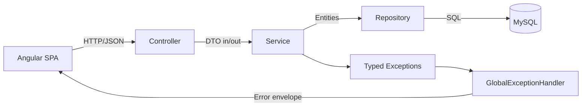
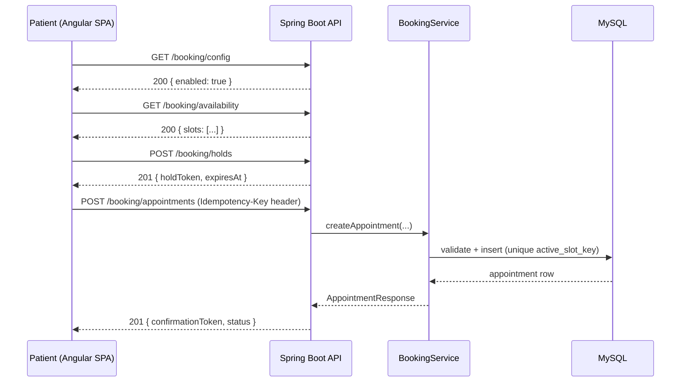
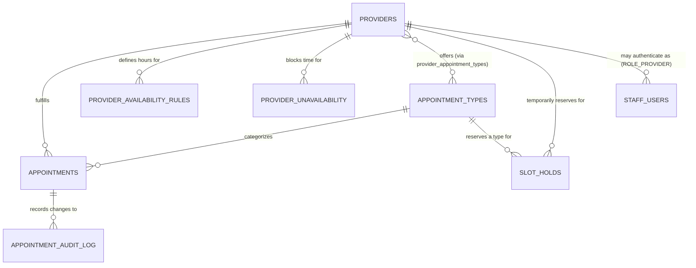

# Riverside Family Clinic — Online Appointment Booking System

A full-stack online appointment booking platform that lets a patient book, view, cancel, and
reschedule an appointment with a clinic provider entirely online — without calling the front
desk or creating an account — while giving clinic staff the tools they need to keep the
schedule correct (approvals, availability management, holidays, audit visibility).

The backend is a Spring Boot 3 REST API backed by MySQL, and the frontend is an Angular 17
single-page application. The project was built as a specification-driven implementation of a
detailed Product Requirements Document (`PRD.md`), following a milestone-by-milestone,
trunk-based development plan (`ImplementationPlan.md`).

---

## Overview

**Purpose.** Replace phone-based appointment scheduling with a self-service online flow for
routine appointment types, while preserving clinic control over appointment types that need
clinical triage before confirmation (new patients, specialist consultations).

**Main objectives**
- Let patients book a routine appointment end-to-end without any staff involvement.
- Structurally prevent double-booked slots, even under concurrent requests.
- Give staff a role-scoped console to manage bookings, provider schedules, holidays, and
  system configuration.
- Ship the entire feature behind a single global kill switch (`enable_online_booking`) so it
  can be rolled back instantly without a redeploy.

**Target users**
| Persona | Authenticated? | What they do |
|---|---|---|
| Patient | No (guest flow, identified by email + phone) | Browse availability, book, view/cancel/reschedule via a confirmation-token link |
| Receptionist (`ROLE_STAFF`) | Yes | List/approve/reject/complete appointments, record provider time-off |
| Provider (`ROLE_PROVIDER`) | Yes | Same as Receptionist, scoped to their own schedule only |
| Clinic Administrator (`ROLE_ADMIN`) | Yes | CRUD on appointment types, providers, availability rules, holidays, feature flag |
| System Administrator (`ROLE_SYSADMIN`) | Yes | Read-only across staff data, audit log access, and the one exception: toggling the feature flag |

**High-level workflow.** A patient picks an appointment type → provider → date/time slot →
temporarily holds that slot for 5 minutes → enters contact details → submits. The booking is
either `CONFIRMED` immediately or `PENDING` staff approval, depending on the appointment type.
A confirmation email is sent either way, and the patient receives a link to view, cancel, or
reschedule the booking at any time before it starts.

---

## Features

- **Appointment Booking** — a five-step wizard (type → provider → date/slot → contact details
  → review) backed by a temporary slot hold so two patients can't both finish checkout for the
  same slot.
- **Appointment Rescheduling** — a single atomic "cancel old + create new" operation; if the
  new slot is lost to a race, the original appointment is left untouched rather than the
  patient ending up with nothing.
- **Appointment Cancellation** — self-service cancellation via a confirmation-token link, up to
  4 hours before the appointment; inside that window the patient is shown the clinic's phone
  number instead.
- **Appointment Availability** — a computed slot grid that subtracts provider working hours,
  breaks, existing bookings (with buffer time), active holds, provider time-off, and clinic
  holidays.
- **Provider Selection** — providers are filtered to only those who actually offer the
  selected appointment type.
- **Appointment Types** — four seeded types (New Patient Intake, General Consultation,
  Follow-Up, Specialist Consultation), each with its own duration, buffer, and
  approval-required flag.
- **Email Notifications** — HTML confirmation, cancellation, and reschedule emails sent via
  real SMTP (Gmail), asynchronously and best-effort (a delivery failure never rolls back the
  booking itself).
- **Validation** — server-side validation for every field (name, email, phone, notes) plus
  business-rule validation (lead time, booking window, weekends/holidays, daily booking limits,
  duplicate-booking prevention), all independent of whatever the frontend already checked.
- **Feature Flags** — a single global `enable_online_booking` flag gates the six
  booking-creation endpoints; viewing/cancelling an appointment that already exists is never
  gated. Cached with a 10-second TTL so a toggle takes effect cluster-wide without a redeploy.
- **Rate Limiting** — per-IP limits on availability lookups (10/min) and slot holds +
  bookings combined (5 per 10 minutes), returning `429` with a `Retry-After` header.
- **Scheduled Jobs** — a slot-hold reaper (every minute), a pending-approval expiry job
  (24 hours), and a nightly missed-appointment marker, each protected by distributed locking
  (ShedLock) so exactly one instance runs a given tick in a multi-instance deployment.
- **Localisation** — UI strings are fully externalised to locale files, with English (`en-US`)
  and Bahasa Melayu (`ms-MY`) both shipped and switchable from the header at runtime.
- **Responsive UI** — Angular Material-based design, usable down to a 360px viewport.
- **Staff Console** — authenticated console for appointment management, provider/availability
  administration, appointment-type and provider CRUD, feature-flag control, and a read-only
  audit log.
- **Security hardening** — BCrypt password hashing, account lockout after repeated failed
  logins, session idle/absolute timeouts, PII masking in logs, CSRF protection for the staff
  console, and a locked-down CORS policy.

---

## Technology Stack

**Frontend**
- Angular 17 (standalone components, signals — no `NgModule` boilerplate)
- Angular Material 17 + Angular CDK
- RxJS
- A lightweight, in-house translation service (`TranslateService`/`TranslatePipe`) for i18n
- Karma + Jasmine for unit tests

**Backend**
- Java 17
- Spring Boot 3.3.4 (Web, Data JPA, Validation, AOP, Security, Mail, Actuator)
- Spring Data JPA / Hibernate
- Micrometer + Prometheus (metrics)
- Caffeine (in-memory cache for the feature flag)
- ShedLock 7.7.0 (distributed scheduled-job locking)

**Database**
- MySQL 8/9
- Flyway (versioned, additive-only migrations)

**Build tools**
- Maven (backend)
- Angular CLI (frontend)

**Testing frameworks**
- JUnit 5 + AssertJ + Mockito (backend unit tests, via Surefire)
- Real-MySQL integration tests (via Failsafe, `*IT.java` naming convention)
- Karma/Jasmine (frontend unit tests)
- axe-core + Puppeteer (accessibility auditing)
- k6 (load-test plan)

**Key libraries/dependencies**
- `mysql-connector-j`, `flyway-mysql`
- `shedlock-spring`, `shedlock-provider-jdbc-template`
- `spring-boot-starter-mail` (Jakarta Mail / SMTP)
- `httpclient5` (used by integration tests)

---

## Project Architecture

### Backend — layered architecture

The backend follows a strict, one-directional Clean Architecture layering: a controller never
contains business logic, and a repository never contains business logic either — all of it
lives in the service layer.



- **Controllers** map HTTP ↔ DTOs and delegate to exactly one service method per endpoint.
  The feature-flag check is never an `if` inside a controller — it's a `@FeatureGate`
  annotation resolved by a Spring AOP aspect (`FeatureGateAspect`), so the "check the flag
  first" rule is structurally guaranteed rather than left to convention.
- **DTOs** (Java records) are the only thing ever serialized to JSON — a JPA entity is never
  returned directly, which prevents internal fields (e.g. optimistic-lock version numbers)
  from leaking into API responses.
- **Services** hold every business rule and are the only layer that opens a `@Transactional`
  boundary.
- **Repositories** are Spring Data JPA interfaces only — no hand-built SQL string
  concatenation anywhere in the codebase.
- **Exception handling** — every business-rule violation throws a distinct typed exception
  (e.g. `SlotAlreadyBookedException`, `LeadTimeViolationException`), and a single
  `@RestControllerAdvice` (`GlobalExceptionHandler`) maps each one to a consistent JSON error
  envelope with the right HTTP status and `errorCode`.

### Request lifecycle (booking creation)



### Frontend architecture

- Angular 17 standalone components throughout — no `NgModule`s.
- Local component state is managed with **signals**; the multi-step booking wizard shares
  state through a single injectable `BookingStateService` (no NgRx — the wizard's state needs
  are linear and don't cross into unrelated feature areas).
- A global `HttpErrorInterceptor` maps every backend `errorCode` to a user-facing message from
  one lookup table, so no individual page hardcodes its own error strings.
- Route guards (`feature-flag.guard.ts`, `session.guard.ts`, `role.guard.ts`) control access to
  the booking wizard and the staff console; server-side authorization is always the actual
  source of truth — guards exist to avoid a confusing dead-end click, not as security.
- Shared, presentation-only layout components (`app-header`, `booking-stepper`,
  `booking-sidebar`, `booking-info-banner`) are reused across every booking page.

### Folder organisation

The codebase separates the two applications completely — `backend/` (Spring Boot/Maven) and
`frontend/` (Angular/npm) — each independently buildable and testable.

---

## Project Structure

```
appointment-booking/
├── PRD.md                       # Product Requirements Document (source of truth for all business rules)
├── ImplementationPlan.md        # Milestone-by-milestone build plan
├── docs/                        # Verification artifacts (production readiness, accessibility, flag rollout)
├── perf/                        # k6 load-test plan
│
├── backend/
│   ├── pom.xml
│   └── src/
│       ├── main/
│       │   ├── java/com/clinic/booking/
│       │   │   ├── booking/
│       │   │   │   ├── controller/     # REST controllers (patient-facing booking endpoints)
│       │   │   │   ├── service/        # Business logic (BookingService, AvailabilityService, RescheduleService, ...)
│       │   │   │   ├── repository/     # Spring Data JPA repositories
│       │   │   │   ├── domain/         # JPA entities
│       │   │   │   ├── dto/            # Request/response records
│       │   │   │   ├── validation/     # Reusable business-rule validators
│       │   │   │   └── job/            # Scheduled jobs (hold reaper, approval timeout, missed-marker)
│       │   │   ├── staff/              # Authenticated staff console (auth, appointments, admin, security)
│       │   │   ├── notification/       # EmailNotificationService
│       │   │   ├── audit/              # Audit log writer
│       │   │   ├── config/             # Feature flags, security, CORS, rate limiting, logging, metrics
│       │   │   └── common/             # Shared exceptions and utilities
│       │   └── resources/
│       │       ├── application.yml
│       │       └── db/migration/       # Flyway migrations, V1 → V13
│       └── test/java/com/clinic/booking/   # Unit tests (*Test.java) and integration tests (*IT.java)
│
└── frontend/
    ├── angular.json
    ├── package.json
    ├── proxy.conf.json           # Dev-server proxy: /api → http://localhost:8080
    └── src/
        ├── app/
        │   ├── landing/                    # Public landing page
        │   ├── faq/                        # FAQ page
        │   ├── booking/                    # Patient booking wizard (5 steps) + state/services
        │   ├── appointment-lookup/         # View/cancel/reschedule by confirmation token
        │   ├── staff/                      # Authenticated staff console
        │   │   ├── auth/                   # Login, session/role guards
        │   │   ├── appointments/           # Appointment list/detail + lifecycle actions
        │   │   ├── availability/           # Hours, time-off, holidays
        │   │   ├── admin/                  # Appointment types, providers, feature-flag settings
        │   │   └── audit-log/              # Read-only audit trail viewer
        │   ├── core/                       # Guards, interceptors, i18n service, shared constants
        │   └── shared/                     # Reusable layout and presentational components
        └── assets/i18n/                    # en-US.json, ms-MY.json
```

---

## Database Design

MySQL, versioned exclusively through Flyway migrations (`V1` … `V13`), applied automatically on
application startup. Every migration is additive-only — a column is never dropped or renamed
in the same release that replaces it.

| Migration | Table | Purpose |
|---|---|---|
| V1 | `providers` | Clinic providers (name, specialty, timezone, active/soft-deleted) |
| V2 | `appointment_types` | The four bookable appointment types and their rules |
| V3 | `provider_appointment_types` | Join table: which providers offer which types |
| V4 | `feature_flags` | The single `enable_online_booking` flag |
| V5 | `provider_availability_rules` | Recurring weekly working hours / breaks per provider |
| V6 | `provider_unavailability` | One-off time-off blocks (vacation, sick leave) |
| V7 | `clinic_holidays` | Clinic-wide closures, apply to every provider |
| V8 | `slot_holds` | Temporary (5-minute) reservation before a booking is confirmed |
| V9 | `shedlock` | Distributed-lock bookkeeping for the scheduled jobs |
| V10 | `appointments` | The core appointment record |
| V11 | `appointment_audit_log` | One row per status transition, for traceability |
| V12 | `staff_users` | Staff accounts, roles, and lockout tracking |
| V13 | *(data migration)* | Flips `enable_online_booking` to `TRUE` for this deployment |

### Entity relationships



### Notable design decisions

- **`active_slot_key`** — a generated, stored column on `appointments` that is `NULL` for
  terminal statuses (cancelled/completed/etc.) and a deterministic `provider_id` + `start_time`
  composite otherwise, with a `UNIQUE` index on it. MySQL treats multiple `NULL`s in a unique
  index as distinct, which is how this table structurally guarantees "no two active
  appointments for the same provider at the same time" — enforced by the database, not just
  application code.
- **Soft delete** — only `providers` and `appointments` have a `deleted_at` column, since they
  are the two tables referenced by historical, patient-facing data that must remain readable
  after a provider leaves or a booking is superseded.
- **UTC everywhere** — every timestamp is stored and transmitted in UTC; the UI is always the
  layer responsible for rendering clinic-local time.

---

## API Documentation

Base path: `/api/v1`. All timestamps are ISO-8601 UTC. Every error response uses a consistent
JSON envelope: `{ "timestamp", "status", "errorCode", "message", "path", "fieldErrors" }`.

### Patient-facing booking endpoints

| Method | Endpoint | Description | Gated by flag? |
|---|---|---|---|
| GET | `/booking/config` | Whether online booking is currently enabled | No |
| GET | `/booking/appointment-types` | List active appointment types | Yes |
| GET | `/booking/providers?appointmentTypeId=` | Providers offering a given type | Yes |
| GET | `/booking/availability?providerId=&appointmentTypeId=&date=` | Computed open slots for a date | Yes |
| POST | `/booking/holds` | Temporarily reserve a slot (5-minute TTL) | Yes |
| POST | `/booking/appointments` | Create a booking (requires `Idempotency-Key` header) | Yes |
| GET | `/booking/appointments/{confirmationToken}` | View an existing booking | No |
| DELETE | `/booking/appointments/{confirmationToken}` | Cancel an existing booking | No |
| POST | `/booking/appointments/{confirmationToken}/reschedule` | Atomically cancel + rebook | Yes |

**Example — create a booking**

Request:
```json
POST /api/v1/booking/appointments
Idempotency-Key: 5b1f6e2a-9c3d-4e21-8b7a-2f6d9c1a0e44

{
  "holdToken": "b3f1c9a2-...",
  "patientFullName": "Jordan Rivera",
  "patientEmail": "jordan@example.com",
  "patientPhone": "+14155551234",
  "notes": "First visit, referred by Dr. Lee"
}
```

Response:
```json
201 Created
{ "confirmationToken": "9a7e...", "status": "CONFIRMED", "providerId": 5, "startDateTime": "2026-08-15T13:00:00Z" }
```

**Validation on this endpoint:** `patientFullName` (2–100 chars, letters/space/hyphen/apostrophe
only), `patientEmail` (RFC 5322, max 254 chars), `patientPhone` (E.164 format), `notes`
(optional, max 500 chars, HTML stripped server-side).

**Possible errors:** `400 VALIDATION_ERROR`, `400 LEAD_TIME_VIOLATION`, `400
BOOKING_WINDOW_EXCEEDED`, `400 CLINIC_CLOSED_DAY`, `403 FEATURE_DISABLED`, `409
SLOT_ALREADY_BOOKED`, `409 PATIENT_DAILY_LIMIT_EXCEEDED`, `409 DUPLICATE_APPOINTMENT`, `409
IDEMPOTENCY_KEY_REUSED_MISMATCH`, `410 SLOT_HOLD_EXPIRED`.

### Staff console endpoints

| Method | Endpoint | Auth required | Description |
|---|---|---|---|
| POST | `/staff/auth/login` | Public | Staff login (issues session cookie + CSRF token) |
| POST | `/staff/auth/logout` | Any staff session | Invalidate the session |
| GET | `/staff/auth/session` | Any staff session | Bootstrap the SPA's auth state |
| GET | `/staff/appointments` | `ROLE_STAFF`+ | Paginated, filterable appointment list |
| POST | `/staff/appointments/{id}/approve` \| `/reject` \| `/complete` | `ROLE_STAFF`/`ROLE_ADMIN`/owning `ROLE_PROVIDER` | Lifecycle transitions (optimistic-locked via `If-Match`) |
| GET/POST/PUT/DELETE | `/staff/appointment-types` | `ROLE_STAFF`+ (read) / `ROLE_ADMIN` (write) | Appointment-type CRUD |
| GET/POST/PUT/DELETE | `/staff/providers` | `ROLE_STAFF`+ (read) / `ROLE_ADMIN` (write) | Provider CRUD |
| GET/POST/PUT/DELETE | `/staff/providers/{id}/availability-rules` | `ROLE_STAFF`+ (read) / `ROLE_ADMIN` (write) | Weekly working-hours rules |
| GET/POST/DELETE | `/staff/providers/{id}/unavailability` | `ROLE_STAFF`+ (read) / `ROLE_STAFF`,`ROLE_ADMIN` (write) | Ad hoc time-off |
| GET/POST/PUT/DELETE | `/staff/holidays` | `ROLE_STAFF`+ (read) / `ROLE_ADMIN` (write) | Clinic holiday calendar |
| GET/PUT | `/staff/feature-flags/{flagName}` | `ROLE_ADMIN`+ (read) / `ROLE_ADMIN`,`ROLE_SYSADMIN` (write) | Feature-flag toggle |
| GET | `/staff/audit-log` | `ROLE_SYSADMIN` only | Read-only appointment state-change history |

All staff-console list endpoints share one pagination contract: `page` (default `0`), `size`
(default `20`, max `100`, clamped not rejected), and a whitelisted `sort` parameter.

---

## Business Rules

Written in plain terms — the authoritative, numbered version of every rule lives in `PRD.md`.

- **Feature flag** — the whole booking-creation flow can be switched off instantly via one
  flag. When off, patients can still view/cancel a booking they already have; they just can't
  make a new one.
- **Booking window** — a patient can only book at least 24 hours ahead, and no more than 90
  days ahead.
- **Clinic hours** — weekends are blocked by default unless a provider explicitly works that
  day; clinic-wide holidays block every provider with no override.
- **Daily limit** — a patient (identified by email + phone, since there's no login) can have at
  most 1 active appointment with the same provider per day, and at most 3 active appointments
  total per day across all providers.
- **Duplicate prevention** — a patient can't book the same provider twice for an overlapping
  time while they already have an active appointment there.
- **Double-booking prevention** — enforced at the database level (not just in application
  code), so it holds even under two simultaneous requests for the same slot.
- **Slot holds** — reserving a slot gives a patient 5 minutes to finish the booking form before
  the hold expires and the slot becomes available again.
- **Idempotent submission** — retrying the same booking request with the same idempotency key
  returns the original result instead of creating a duplicate.
- **Cancellation cutoff** — self-service cancellation is allowed up to 4 hours before the
  appointment; inside that window, the patient is directed to call the clinic.
- **Rescheduling** — implemented as one atomic operation (cancel the old slot, book the new
  one); if the new slot is lost to another patient in the same instant, the original booking is
  left exactly as it was.
- **Approval workflow** — some appointment types (new patient, specialist) require staff
  approval before they're confirmed; an unapproved request auto-expires after 24 hours with no
  staff action.
- **Rate limiting** — protects against abuse of the availability search and booking-creation
  endpoints on a per-IP basis.
- **Staff account lockout** — 5 consecutive failed logins locks an account for 15 minutes; the
  failure counter only resets on a successful login, not merely once the lockout window passes.

---

## Installation

### Prerequisites

- **Java 17** (LTS)
- **Node.js** 18+ and npm
- **MySQL 8** or newer
- **Maven** (or use the included `mvnw` wrapper, if present)
- **Angular CLI** (`npm install -g @angular/cli`)

### Database setup

Create the database and an application user (adjust credentials as needed):

```sql
CREATE DATABASE booking_db;
CREATE USER 'booking_app'@'%' IDENTIFIED BY 'booking_app_pw';
GRANT ALL PRIVILEGES ON booking_db.* TO 'booking_app'@'%';
```

Flyway will create every table automatically the first time the backend starts — no manual DDL
is required.

### Backend

```bash
cd backend
mvn clean install       # build + run unit tests
mvn spring-boot:run      # start the API on http://localhost:8080
```

### Frontend

```bash
cd frontend
npm install
npm start                 # ng serve, proxied to the backend via proxy.conf.json, http://localhost:4200
```

---

## Configuration

### Backend (`backend/src/main/resources/application.yml`)

Configuration follows Spring Boot's standard `${ENV_VAR:default}` pattern — every value can be
overridden via an environment variable without touching the file.

| Environment variable | Default | Purpose |
|---|---|---|
| `DB_HOST` | `localhost` | MySQL host |
| `DB_PORT` | `3306` | MySQL port |
| `DB_NAME` | `booking_db` | Database name |
| `DB_USERNAME` | `booking_app` | Database user |
| `DB_PASSWORD` | `booking_app_pw` | Database password |
| `GMAIL_APP_PASSWORD` | *(dummy placeholder)* | Gmail SMTP app password for outbound email |
| `NOTIFICATION_BCC_EMAIL` | *(blank — disabled)* | Optional BCC address for patient notification emails |
| `CLINIC_TIMEZONE` | `Asia/Kuala_Lumpur` | The clinic's single configured IANA timezone |
| `SERVER_PORT` | `8080` | HTTP port the API listens on |

All other numeric business rules (lead time, booking window, hold duration, rate limits,
lockout thresholds, session timeouts, etc.) live in one place —
`BookingProperties` (`@ConfigurationProperties(prefix = "booking")`) — rather than being
hardcoded inline anywhere in the service layer.

### Email configuration

Outbound email uses Spring Mail over SMTP (configured for Gmail by default:
`smtp.gmail.com:587` with STARTTLS). The "From" address is the same account configured for
SMTP authentication (`spring.mail.username`) — there is no separate hardcoded sender. An
optional BCC address can be set via `NOTIFICATION_BCC_EMAIL`; it is blank (disabled) by
default, since patient contact details appear in the email body.

### Database configuration

The datasource, connection pool size (HikariCP, 20 connections per instance), and Flyway
settings are all under `spring.datasource`/`spring.flyway` in `application.yml`. Migrations run
automatically on startup; there is no separate manual migration step.

---

## Running Tests

### Backend

```bash
cd backend
mvn test          # unit tests only (Surefire) — fast, no external dependencies beyond a local MySQL instance
mvn verify         # unit tests + integration tests (Failsafe) — requires a running local MySQL instance
```

Integration tests (files named `*IT.java`) exercise the real REST endpoints against a real
local MySQL schema rather than mocks, including concurrency scenarios (simultaneous booking
requests racing for the same slot) and scheduled-job behaviour. Unit tests (files named
`*Test.java`) cover services and utilities in isolation.

### Frontend

```bash
cd frontend
npm test           # Karma + Jasmine, headless Chrome
ng build           # production build; also surfaces any TypeScript compile errors
```

### Accessibility & performance

- An axe-core/Puppeteer accessibility audit was run against every screen (see
  `docs/accessibility-audit.md`).
- A k6 load-test plan targeting the PRD's P95 latency budgets is available at
  `perf/load-test-plan.js`.

---

## Screenshots

> _Add screenshots of the following screens here:_

- `[ Landing page ]`
- `[ Booking wizard — type / provider / schedule / contact / review ]`
- `[ Booking confirmation screen ]`
- `[ Appointment lookup / cancel / reschedule ]`
- `[ Staff login ]`
- `[ Staff appointment console ]`
- `[ Staff availability & admin screens ]`
- `[ Audit log viewer ]`

---

## Development Workflow

This project was built milestone by milestone against a fully specified PRD (`PRD.md`) and an
accompanying implementation plan (`ImplementationPlan.md`), following trunk-based development —
every milestone merged straight to the main branch behind the `enable_online_booking` feature
flag, which stayed off until the patient-facing flow was complete end-to-end. In order:

1. **Foundation & core schema** — project scaffolding, first migrations, seed data.
2. **Feature flag & reference reads** — the flag mechanism and first read-only endpoints.
3. **Availability engine** — the slot-computation logic.
4. **Slot holds & locking infrastructure** — the temporary reservation mechanism and
   distributed-locking groundwork.
5. **Booking creation** — the core transactional booking endpoint.
6. **Patient self-service** — view/cancel by confirmation token.
7. **Booking wizard frontend** — the first complete, end-to-end patient journey.
8. **Staff authentication** — login, sessions, lockout.
9. **Staff appointment console** — list/approve/reject/complete.
10. **Staff scheduling & admin console** — availability rules, holidays, CRUD screens.
11. **Audit log & scheduled jobs** — the automated lifecycle jobs and their read-only viewer.
12. **Reschedule** — the atomic cancel-and-rebook endpoint.
13. **Security & cross-cutting hardening** — rate limiting, log masking, i18n readiness,
    observability.
14. **Final verification & go-live readiness** — full acceptance-criteria/edge-case
    traceability, load-test plan, production readiness checklist.

**Testing approach.** Business rules are tested at two levels: unit tests for services and
validators in isolation, and integration tests that exercise real HTTP endpoints against a real
database, so that concurrency-sensitive guarantees (like double-booking prevention) are proven
against the actual database constraint, not a mock. Acceptance criteria and edge cases named in
the PRD are traced to specific tests rather than left as an informal checklist.

---

## Challenges

- **Double-booking under concurrency.** MySQL has no native partial/filtered unique index, which
  is what "no two active appointments for the same slot, but unlimited cancelled history for
  that same slot" really requires. This was solved with a generated, stored `active_slot_key`
  column that evaluates to `NULL` for any terminal status — MySQL treats multiple `NULL`s in a
  unique index as distinct, which gives the same effect as a partial unique index without one.
- **Atomic rescheduling.** A reschedule is really two operations (cancel the old booking, create
  the new one) that must succeed or fail together — otherwise a lost race for the new slot could
  leave a patient with no appointment at all. This is implemented as a single `@Transactional`
  service method so a losing race rolls back the cancellation too, restoring the original
  booking exactly as it was.
- **Soft-deleted providers with historical data.** A provider can be deactivated or soft-deleted
  without breaking referential integrity for their past appointments — historical bookings keep
  displaying the provider's name correctly, they just stop appearing as bookable going forward.
- **Feature-flag cache convergence.** The flag is cached in-memory for performance, but an
  admin's own toggle must be reflected on their very next request rather than waiting out the
  cache TTL — solved by having the write path evict the writing instance's own cache entry
  synchronously, while other instances still converge within the TTL window.
- **Scheduled jobs on multiple instances.** Without care, a horizontally-scaled deployment would
  run the same nightly job on every instance simultaneously. Distributed locking (ShedLock)
  ensures exactly one instance executes a given scheduled run, layered on top of (not instead
  of) idempotent, state-based queries that are already safe to re-run.

---

## Future Improvements

Realistic items not currently implemented:

- Propagating `X-Request-Id` into the audit log for full request-to-record traceability.
- Validating that the `Idempotency-Key` header is a well-formed UUID (currently only checked
  for presence).
- Mapping specific downstream failure scenarios (connection-pool exhaustion, timeouts) to the
  `503`/`504` error codes already documented in the API error catalog.
- A generic catch-all exception handler that guarantees even an unclassified server error
  returns the standard JSON error envelope.
- A staff-initiated "cancel at any time, no cutoff" action from the console (currently only
  self-service, cutoff-limited patient cancellation exists).
- Persisting the selected UI language across a page refresh (currently resets to English).
- Payment collection, insurance verification, multi-clinic support, native mobile apps, and
  recurring appointments are all explicitly out of scope for this release.

---

## Contributing

1. Create a short-lived feature branch off `main`.
2. Follow the existing layering conventions (controller → service → repository) and keep
   business logic out of controllers.
3. Add or update tests for any behavioural change — unit tests for logic in isolation,
   integration tests for anything touching the database or a real HTTP contract.
4. Use [Conventional Commits](https://www.conventionalcommits.org/) style messages
   (`feat:`, `fix:`, `chore:`, `test:`, `docs:`).
5. Ensure `mvn verify` (backend) and `ng build`/`npm test` (frontend) all pass before opening a
   pull request.
6. Keep migrations additive-only — never edit a migration that has already been merged.

---

## License

This project does not currently declare a license. If you intend to open-source it, the MIT
License is a common permissive choice:

```
MIT License

Copyright (c) 2026

Permission is hereby granted, free of charge, to any person obtaining a copy
of this software and associated documentation files (the "Software"), to deal
in the Software without restriction, including without limitation the rights
to use, copy, modify, merge, publish, distribute, sublicense, and/or sell
copies of the Software, and to permit persons to whom the Software is
furnished to do so, subject to the following conditions:

The above copyright notice and this permission notice shall be included in all
copies or substantial portions of the Software.

THE SOFTWARE IS PROVIDED "AS IS", WITHOUT WARRANTY OF ANY KIND, EXPRESS OR
IMPLIED, INCLUDING BUT NOT LIMITED TO THE WARRANTIES OF MERCHANTABILITY,
FITNESS FOR A PARTICULAR PURPOSE AND NONINFRINGEMENT. IN NO EVENT SHALL THE
AUTHORS OR COPYRIGHT HOLDERS BE LIABLE FOR ANY CLAIM, DAMAGES OR OTHER
LIABILITY, WHETHER IN AN ACTION OF CONTRACT, TORT OR OTHERWISE, ARISING FROM,
OUT OF OR IN CONNECTION WITH THE SOFTWARE OR THE USE OR OTHER DEALINGS IN THE
SOFTWARE.
```
